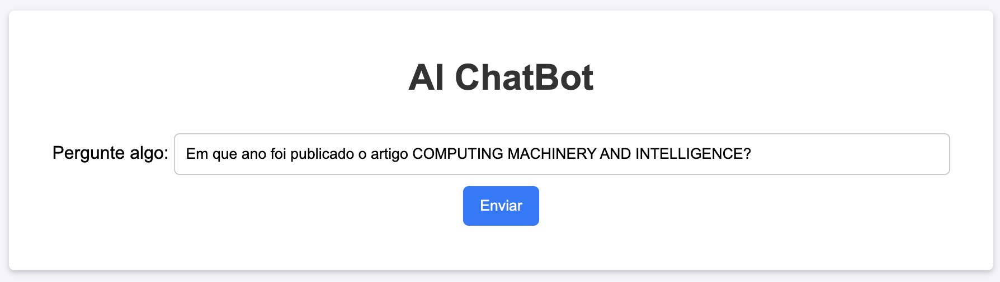
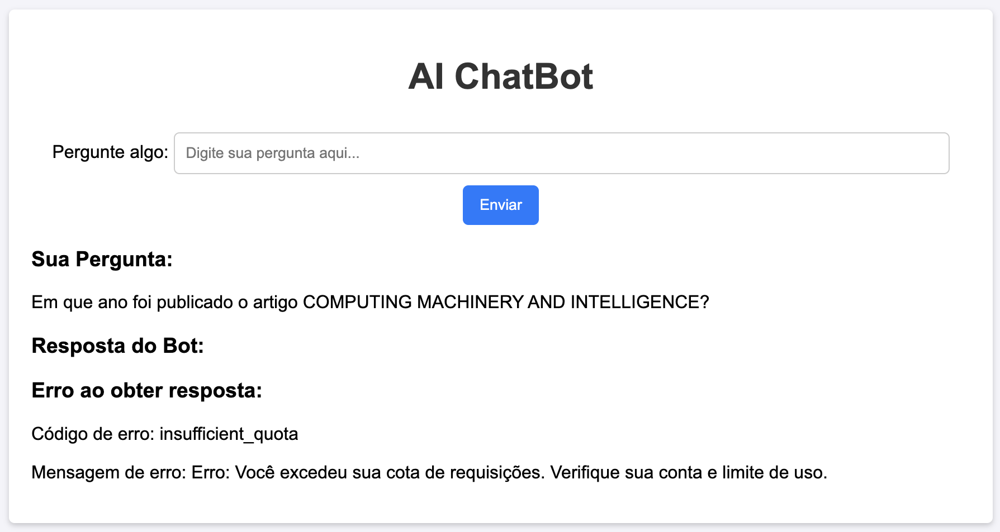

# AIChatBotAPI

Este é um projeto de API para integração com o modelo de linguagem da OpenAI, permitindo a criação de um chatbot inteligente. A API expõe endpoints que podem ser utilizados para enviar perguntas e receber respostas do modelo, além de proporcionar um front-end simples para interação com o bot.

## Dependências

No arquivo `pom.xml`, adicione a dependência abaixo para usar o Thymeleaf com Spring Boot:

```xml
<dependency>
    <groupId>org.springframework.boot</groupId>
    <artifactId>spring-boot-starter-thymeleaf</artifactId>
</dependency>
```

## Estrutura do Projeto

A estrutura do projeto é organizada da seguinte maneira:

```
AIChatBotAPI
│
├── src
│   └── main
│       ├── java
│       │   └── com.example.AIChatBotAPI
│       │       ├── application
│       │       │   └── AiChatBotApiApplication.java
│       │       ├── config
│       │       │   └── ApiConfig.java
│       │       ├── controller
│       │       │   └── AiChatBotApiController.java
│       │       ├── model
│       │       │   └── ApiResponse.java
│       │       └── service
│       │           └── AiChatBotApiService.java
│       └── resources
│           ├── application.properties
│           ├── static
│           │   └── css
│           │       └── style.css
│           └── templates
│               └── home.html

```

## Endpoints

A aplicação possui os seguintes endpoints principais:

### `@GetMapping("/")`
Este endpoint renderiza a página inicial (home) onde o usuário pode interagir com o chatbot.

### `@PostMapping("/ask")`
Este endpoint recebe uma pergunta via `POST` e interage com o modelo de linguagem da OpenAI para obter uma resposta. A resposta, incluindo dados de erro, é exibida na página inicial.

```java
@PostMapping("/ask")
public String askAI(@RequestParam("question") String question, Model model) {
    ApiResponse apiResponse = aiChatBotApiService.getResponseFromAI(question);

    model.addAttribute("question", question);
    model.addAttribute("response", apiResponse.getMessage());
    model.addAttribute("isSuccess", apiResponse.isSuccess());
    model.addAttribute("errorMessage", apiResponse.getErrorMessage());
    model.addAttribute("errorCode", apiResponse.getErrorCode());

    return "home";
}
```

## Capturas de Tela

|  |  |
|:----------------------:|:----------------------:|
|         Home 1         |         Home 2         | 

## Documentação e Links Úteis

- [Visão geral da API da OpenAI](https://platform.openai.com/docs/overview)
- [Referência da API da OpenAI](https://platform.openai.com/docs/api-reference/introduction)
- [Códigos de erro da API](https://platform.openai.com/docs/guides/error-codes/api-errors)
- [Limites de taxa da API](https://platform.openai.com/docs/guides/rate-limits)
- [Limites da sua organização](https://platform.openai.com/settings/organization/limits)
- [Uso da organização na OpenAI](https://platform.openai.com/settings/organization/usage)
- [Página de uso da OpenAI](https://platform.openai.com/usage)
- [Endpoint de completions da API](https://api.openai.com/v1/completions)

## Licença

Este projeto é de código aberto e está licenciado sob a MIT License. Sinta-se livre para usá-lo e modificá-lo conforme necessário.
