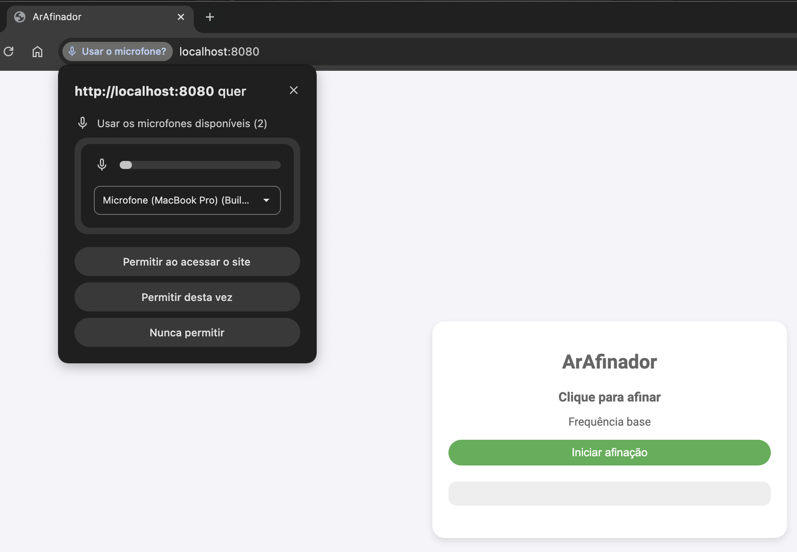
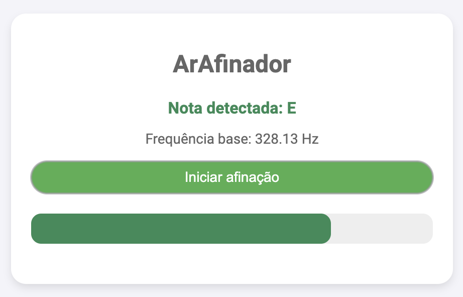
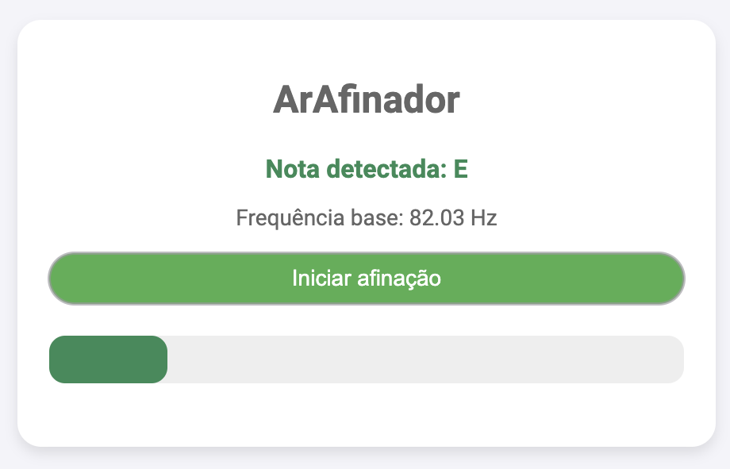
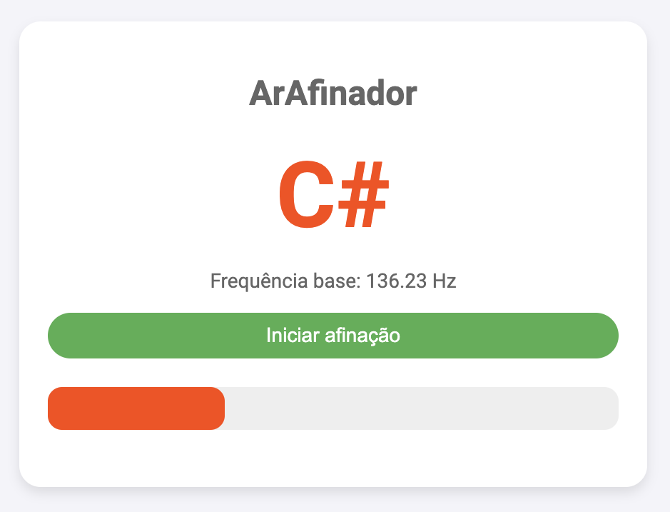
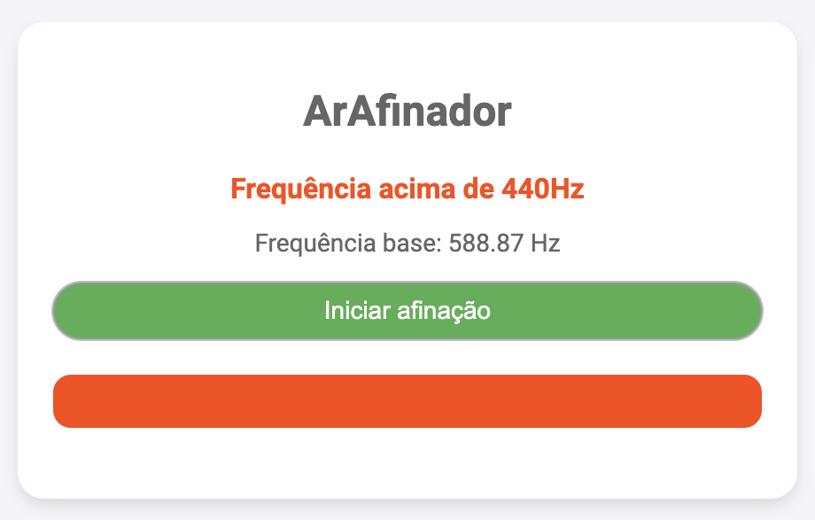

# ArAfinador

O **ArAfinador** é um afinador de instrumentos desenvolvido com **JavaScript puro**, permitindo uma experiência rápida e eficiente sem depender de bibliotecas externas pesadas. O projeto faz uso do **Spring Boot** e **Thymeleaf** para fornecer a estrutura de backend e renderização dinâmica de conteúdo HTML. O afinador é projetado para detectar a frequência do som de um instrumento, identificar a nota correspondente e indicar se ela está afinada.

A funcionalidade principal do projeto é a detecção da nota musical gerada pela frequência do som e a exibição de uma barra de frequência, que visualiza a afinidade do som com a nota correta.

## Captura de Tela

|  |
|:-------:|
| Home |

|  |  |
|:-------:|:------:|
| Mizinha | Mizona | 

|  |  |
|:-------:|:------:|
| Desafinada | Acima de 440Hz | 

## Estrutura do Projeto
A estrutura do projeto é organizada da seguinte maneira:

```
ArAfinador
│
├── src
│   └── main
│       ├── java
│       │   └── com.example.ArAfinador
│       │       ├── application
│       │       │   └── ArAfinadorApplication.java
│       │       └── controller
│       │           └── ArAfinadorController.java
│       └── resources
│           ├── application.properties
│           ├── static
│           │   ├── css
│           │   │   └── style.css
│           │   └── js
│           │       └── afinador.js
│           └── templates
│               └── home.html
```

## Dependências

Abaixo estão as dependências utilizadas no projeto:

```xml
<dependency>
    <groupId>org.springframework.boot</groupId>
    <artifactId>spring-boot-starter-thymeleaf</artifactId>
</dependency>
```

## Arquivo HTML

Abaixo está a estrutura do arquivo HTML utilizado no projeto, que faz a integração com o JavaScript para detectar e exibir a frequência de som:

```html
<!DOCTYPE html>
<html xmlns:th="http://www.thymeleaf.org">
<head>
    <meta charset="UTF-8">
    <title>ArAfinador</title>
    <link rel="stylesheet" th:href="@{/css/style.css}">
</head>
<body>
<div class="container">
    <h1>ArAfinador</h1>
    <h2 id="nota">#</h2>
    <p id="frequencia">Frequência base: Hz</p>
    <button onclick="startListening()">Iniciar afinação</button>
    <div id="frequencia-bar-container">
        <div id="frequencia-bar"></div>
    </div>
</div>
<script src="/js/afinador.js"></script>
</body>
</html>
```

## Funções

O código JavaScript do afinador possui algumas funções principais:

### `startListening()`

Esta função ativa o microfone do dispositivo e começa a capturar o áudio em tempo real. Ela utiliza o `AudioContext` para analisar a frequência do som capturado e determinar a nota musical correspondente. A função atualiza a barra de frequência e exibe a nota detectada.

### `getNota(frequency)`

A função recebe a frequência do som e mapeia para a nota musical mais próxima, considerando uma série de notas afinadas. Caso a frequência não corresponda a nenhuma nota afinada, a função retorna "Nota não detectada". Ela também considera uma tolerância em cents para determinar se a nota está afinada, com um valor padrão de 10 cents. Esse valor pode ser ajustado conforme necessário para maior precisão na detecção da afinidade da nota.

### `updateFrequencyBar(frequency, nota)`

Essa função atualiza a barra de frequência, ajustando sua largura com base na frequência detectada e mudando sua cor conforme a afinidade da nota (afinada ou desafinada).

## Explicação do Código Afinador de Frequências

Este projeto utiliza o **Web Audio API** para detectar a frequência do som captado pelo microfone, identificar a nota musical correspondente e indicar se a nota está afinada ou desafinada. Abaixo, explicamos os principais cálculos e conceitos envolvidos.

---

### 🎵 Fórmula para Cálculo de Cents

Os **cents** são usados para medir a diferença entre duas frequências em um sistema de afinação logarítmica. A fórmula para calcular a diferença em cents é:

```
Cents = 1200 * log2(f_entrada / f_referência)
```

#### Componentes:
- **f_entrada**: Frequência detectada (em Hz).
- **f_referência**: Frequência da nota de referência (em Hz).
- **log2(x)**: Logaritmo na base 2.

#### Explicação:
1. Cada oitava no sistema musical representa um aumento de 2x na frequência.
2. Um semitom equivale a 100 cents, e 12 semitons compõem uma oitava.
3. O cálculo usa o logaritmo na base 2 para determinar quão distante, em termos de tons, a frequência está da nota de referência.

Por exemplo, se a frequência detectada for **450 Hz** e a frequência de referência for **440 Hz**:

```
Cents = 1200 * log2(450 / 440)
Cents ≈ 46.55
```

Isso significa que a frequência detectada está aproximadamente 46.55 cents acima da nota **A4** (440 Hz).

---

### 🎶 Identificação da Nota Musical

O código possui um conjunto de frequências de referência pré-definidas para as notas musicais. Para determinar a nota mais próxima, ele calcula a diferença em cents entre a frequência detectada e cada frequência de referência. A nota com a menor diferença é considerada a nota correspondente.

#### Fluxo do Cálculo:
1. Iterar sobre todas as frequências de referência disponíveis.
2. Calcular os cents para cada frequência de referência.
3. Selecionar a nota com a menor diferença absoluta de cents.

---

### 🎛️ Barra de Frequência

A barra de frequência (`frequencia-bar`) é atualizada para mostrar visualmente a proximidade da frequência detectada em relação ao padrão **A4 (440 Hz)**.

#### Fórmula para Normalização:
```
normalizedFrequency = Math.min(Math.max(frequency / 440, 0), 1) * 100
```

#### Explicação:
1. A frequência é dividida por 440 Hz (A4) para calcular uma proporção.
2. O valor resultante é limitado ao intervalo de **0 a 1**.
3. Multiplica-se por 100 para obter uma porcentagem (0% a 100%).

---

### 🔴 Afinado ou Desafinado

O código avalia se a frequência detectada está suficientemente próxima de uma nota de referência para classificá-la como afinada:

- **Afinado**: Se a diferença em cents for pequena o suficiente.
- **Desafinado**: Se a diferença em cents for grande.

As classes CSS `afinado` e `desafinada` controlam a aparência visual do texto e da barra de frequência.

## Licença

Este projeto está licenciado sob a **MIT License**.
