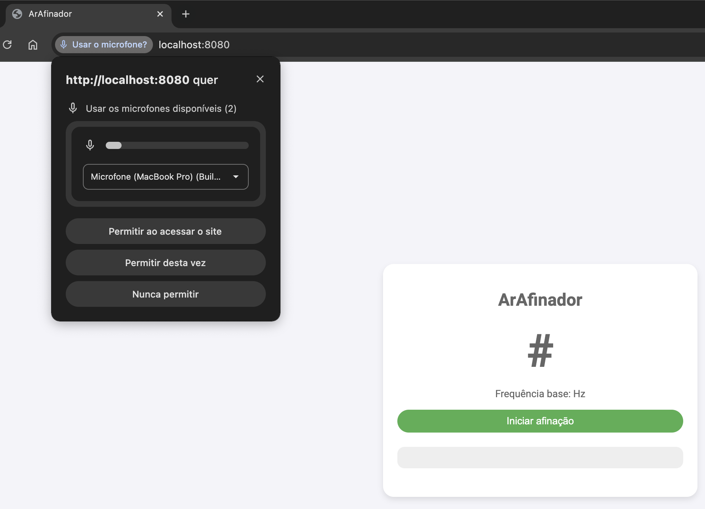
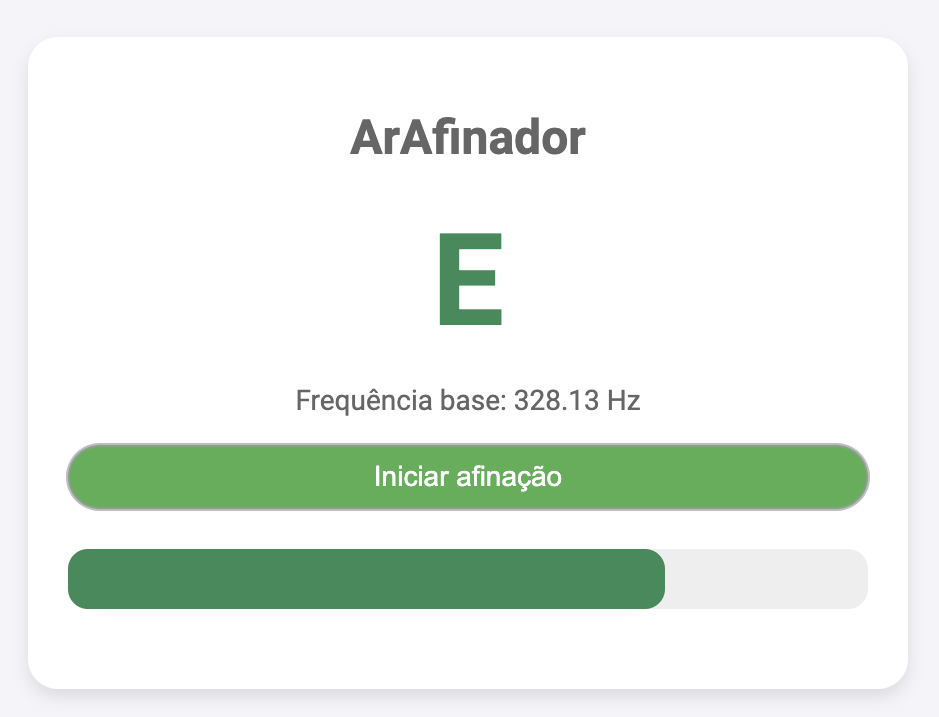

# ArAfinador

O **ArAfinador** é um afinador de instrumentos desenvolvido com **JavaScript puro**, permitindo uma experiência rápida e eficiente sem depender de bibliotecas externas pesadas. O projeto faz uso do **Spring Boot** e **Thymeleaf** para fornecer a estrutura de backend e renderização dinâmica de conteúdo HTML. O afinador é projetado para detectar a frequência de som de um instrumento e indicar sua respectiva nota.

A funcionalidade principal do projeto é a detecção da nota musical gerada pela frequência do som e a exibição de uma barra de frequência, que visualiza a afinidade do som com a nota correta.

## Captura de Tela

|  |
|:--:|
| Tela Inicial - Home |

|  |  |
|:--:|:--:|
| Mizinha | Mizona |

## Dependências

Abaixo estão as dependências utilizadas no projeto:

```xml
<dependency>
    <groupId>org.springframework.boot</groupId>
    <artifactId>spring-boot-starter-thymeleaf</artifactId>
</dependency>
```

## Arquivo HTML

Abaixo está a estrutura do arquivo HTML utilizado no projeto, que faz a integração com o JavaScript para detectar e exibir a frequência de som:

```html
<!DOCTYPE html>
<html xmlns:th="http://www.thymeleaf.org">
<head>
    <meta charset="UTF-8">
    <title>ArAfinador</title>
    <link rel="stylesheet" th:href="@{/css/style.css}">
</head>
<body>
<div class="container">
    <h1>ArAfinador</h1>
    <h2 id="nota">Clique para afinar</h2>
    <p id="frequencia">Frequência base</p>
    <button onclick="startListening()">Iniciar afinação</button>
    <div id="frequencia-bar-container">
        <div id="frequencia-bar"></div>
    </div>
</div>
<script src="/js/afinador.js"></script>
</body>
</html>
```

## Funções

O código JavaScript do afinador possui algumas funções principais:

### `startListening()`

Esta função ativa o microfone do dispositivo e começa a capturar o áudio em tempo real. Ela utiliza o `AudioContext` para analisar a frequência do som capturado e determinar a nota musical correspondente. A função atualiza a barra de frequência e exibe a nota detectada.

### `getNota(frequency)`

A função recebe a frequência do som e mapeia para a nota musical mais próxima, considerando uma série de notas afinadas. Caso a frequência não corresponda a nenhuma nota afinada, a função retorna "Nota não detectada".

### `updateFrequencyBar(frequency, nota)`

Essa função atualiza a barra de frequência, ajustando sua largura com base na frequência detectada e mudando sua cor conforme a afinidade da nota (afinada ou desafinada).

## Licença

Este projeto está licenciado sob a **MIT License**.

