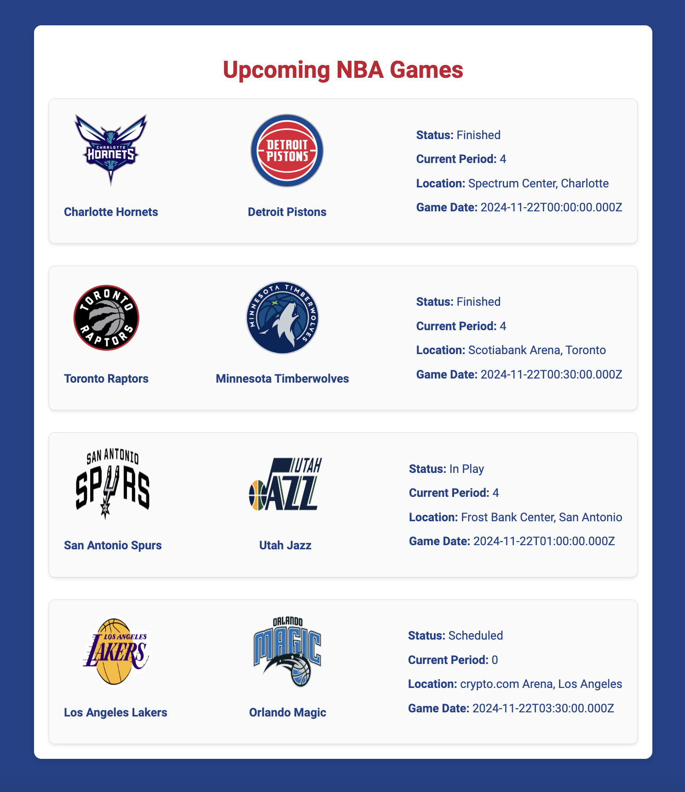

# Projeto BasketballAPI

Este projeto utiliza a NBA API para acessar dados sobre os próximos jogos da NBA. A aplicação realiza requisições à API para listar os jogos de uma data específica (por padrão a data de hoje), exibindo informações detalhadas como times, status do jogo, local e cidade.

## Captura de tela:

|  |
|:------------------------:|
|         Home            |

## Estrutura do projeto:

```
BasketballAPI
│
├── src
│   └── main
│       ├── java
│       │   └── com.example.BasketballAPI
│       │       ├── application
│       │       │   └── BasketballApiApplication.java
│       │       ├── config
│       │       │   ├── ApiConfig.java
│       │       ├── controller
│       │       │   └── BasketballApiController.java
│       │       └── service
│       │           └── BasketballApiService.java
│       └── resources
│           ├── application.properties
│           ├── static
│           │   ├── css
│           │   │   └── style.css
│           └── templates
│               └── home.html
```

## Dependências:

```xml
<dependency>
    <groupId>org.springframework.boot</groupId>
    <artifactId>spring-boot-starter-thymeleaf</artifactId>
</dependency>
```

## Request

`GET : https://v2.nba.api-sports.io`

### Endpoints:

```java
@GetMapping("/")
public String home(@RequestParam(required = false) String date, Model model) {
    // home.html
}
```

## application.properties

```properties
spring.application.name=BasketballAPI
nba.api.key=seutokenaqui
nba.api.date=2024-11-22 (substituído no controller pela data de hoje)
```

## Obter a chave da API

Para utilizar a API do Projeto NBA API, é necessário criar uma conta no site [API-Football](https://www.api-football.com/). Após se cadastrar, você poderá acessar o painel de controle e obter o seu **API Key** (chave da API), que será usada para autenticar as requisições feitas à API. Insira essa chave no código, substituindo a variável `API_KEY` pelo seu token pessoal.

## Limitação diária de requisições

Ao utilizar a API do Projeto NBA API, é importante estar ciente da limitação diária de requisições imposta pelo serviço. Cada conta possui um número máximo de requisições que podem ser feitas por dia, dependendo do plano escolhido. Para garantir o funcionamento contínuo da aplicação, é recomendável monitorar o número de requisições realizadas e, caso necessário, ajustar a frequência de chamadas para não exceder o limite. Mais informações sobre as limitações de requisições podem ser consultadas na [documentação oficial](https://api-sports.io/documentation/nba/v2#section/Introduction).

## Documentação e Links Úteis

- [Documentação da NBA API](https://api-sports.io/documentation/nba/v2#section/Introduction)
- [API Tester](https://dashboard.api-football.com/nba/tester)

## Licença

Este projeto está licenciado sob a Licença MIT.
