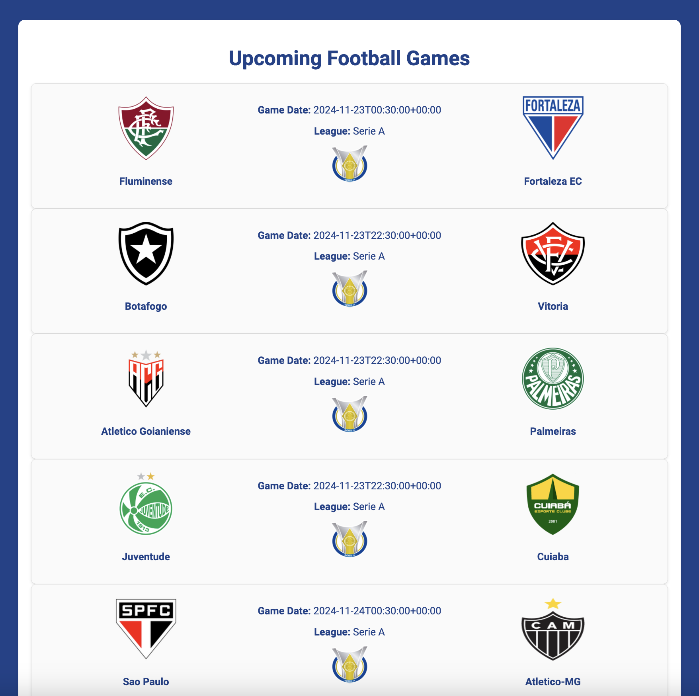

# Projeto FootballAPI

Este projeto utiliza a API Football para acessar dados sobre as ligas de futebol brasileiras, filtrando especificamente pelas ligas desejadas: "Serie A", "Serie B", "Copa Do Brasil" e "Mineiro - 1". A API permite acessar informações sobre os próximos jogos de cada uma dessas ligas.

## Captura de tela:

|  |
|:------------------------:|
|         Home            |

## Estrutura do projeto:

```
FootballAPI
│
├── src
│   └── main
│       ├── java
│       │   └── com.example.FootballAPI
│       │       ├── application
│       │       │   └── FootballApiApplication.java
│       │       ├── config
│       │       │   ├── ApiConfig.java
│       │       ├── controller
│       │       │   └── FootballApiController.java
│       │       └── service
│       │           └── FootballApiService.java
│       └── resources
│           ├── application.properties
│           ├── static
│           │   ├── css
│           │   │   └── style.css
│           └── templates
│               └── home.html
```

## Dependências:

```xml
<dependency>
    <groupId>org.springframework.boot</groupId>
    <artifactId>spring-boot-starter-thymeleaf</artifactId>
</dependency>
```

## Request

- GET : https://v3.football.api-sports.io

### Endpoints:

```java
@GetMapping("/")
    public String home(Model model) {
    // home.html
}
```

## Métodos do Service

### `List<Map<String, Object>> getUpcomingGames()`

Este método é responsável por obter os próximos jogos de futebol, sem filtrar por liga ou campeonato. Ele retorna uma lista de mapas contendo as informações sobre os jogos próximos, que pode incluir detalhes como time da casa, time visitante, horário do jogo, entre outros. 

**O que fazer:**
- O método irá chamar o endpoint `https://v3.football.api-sports.io/fixtures` com os parâmetros necessários, como `next` para definir o número de jogos a serem retornados.

### `List<Map<String, Object>> getBrazilianLeagues()`

Este método faz uma requisição para a API para obter as ligas de futebol brasileiras. Ele retorna uma lista de ligas disponíveis no Brasil, como "Serie A", "Serie B", "Copa do Brasil" e "Mineiro - 1".

**O que fazer:**
- O método irá realizar uma requisição GET para o endpoint `https://v3.football.api-sports.io/leagues?country=Brazil`, filtrando as ligas brasileiras.
- A resposta será manipulada para retornar as informações em formato de lista de mapas.

### `List<Map<String, Object>> getUpcomingFixtures(int leagueId)`

Este método é responsável por obter os próximos jogos de uma liga específica, identificada pelo `leagueId`. Ele pode ser utilizado para filtrar as ligas e obter apenas os jogos futuros de uma liga em particular, como por exemplo, "Serie A" ou "Copa do Brasil".

**O que fazer:**
- O método irá realizar uma requisição GET para o endpoint `https://v3.football.api-sports.io/fixtures`, passando como parâmetros:
  - `league`: O ID da liga (como `leagueId`).
  - `next`: O número de jogos futuros a serem retornados. Por exemplo, limitando a 10 jogos, `params.add("next", "10");`.

O resultado será uma lista de mapas contendo informações detalhadas sobre os jogos agendados.

## application.properties

```properties
spring.application.name=FootballAPI
football.api.key=seutokenaqui
```

## Obter a chave da API

Para utilizar a API do Projeto NBA API, é necessário criar uma conta no site [API-Football](https://www.api-football.com/). Após se cadastrar, você poderá acessar o painel de controle e obter o seu **API Key** (chave da API), que será usada para autenticar as requisições feitas à API. Insira essa chave no código, substituindo a variável `API_KEY` pelo seu token pessoal.

## Limitação diária de requisições

Ao utilizar a API do Projeto Football API, é importante estar ciente da limitação diária de requisições imposta pelo serviço. Cada conta possui um número máximo de requisições que podem ser feitas por dia, dependendo do plano escolhido. Para garantir o funcionamento contínuo da aplicação, é recomendável monitorar o número de requisições realizadas e, caso necessário, ajustar a frequência de chamadas para não exceder o limite. Mais informações sobre as limitações de requisições podem ser consultadas na [documentação oficial](https://www.api-football.com/documentation-v3#section/Introduction).

## Documentação e Links Úteis

- [Documentação da API](https://www.api-football.com/documentation-v3#section/Introduction)
- [API Tester](https://dashboard.api-football.com/soccer/tester)

## Licença

Este projeto está licenciado sob a Licença MIT.
