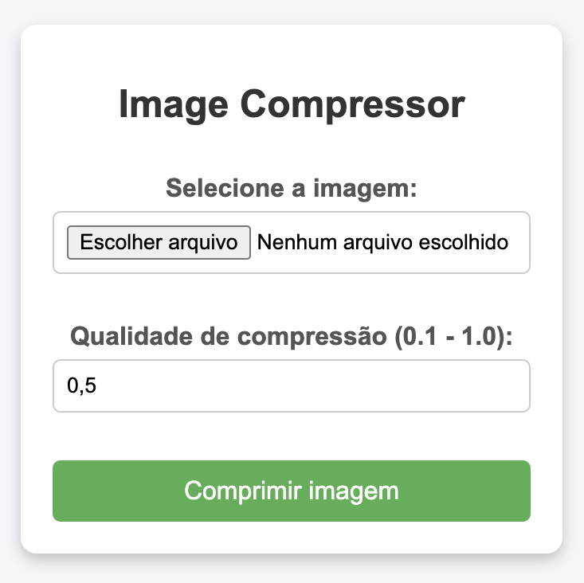

# ImageCompressorWithUI

## Descrição do Projeto
O projeto **ImageCompressorWithUI** é uma aplicação Spring Boot que permite a compressão de imagens enviadas pelo usuário. Através de um endpoint, o usuário pode fazer upload de uma imagem e especificar a qualidade desejada para a compressão. O projeto é útil para reduzir o tamanho das imagens, facilitando o armazenamento e a transferência. Além disso, agora conta com uma interface gráfica desenvolvida utilizando Thymeleaf, que proporciona uma experiência de usuário mais interativa e intuitiva.

## Configurações
As configurações do projeto podem ser encontradas no arquivo `application.properties`:

```properties
spring.application.name=ImageCompressorWithUI
spring.servlet.multipart.max-file-size=10MB
spring.servlet.multipart.max-request-size=10MB
```

No arquivo `pom.xml`, adicione a dependência do Thymeleaf:

```xml
<dependency>
    <groupId>org.springframework.boot</groupId>
    <artifactId>spring-boot-starter-thymeleaf</artifactId>
</dependency>
```

## Estrutura do Projeto
- `application` -> `ImageCompressorApplication.java`
- `controller` -> `ImageCompressorController.java`
- `service` -> `ImageCompressorService.java`
- `templates` -> Contém os templates Thymeleaf para a interface gráfica

## Endpoints
### POST /images/compress
Esse endpoint permite que o usuário envie uma imagem para compressão.

#### Parâmetros:
- `file`: O arquivo da imagem a ser comprimido.
- `quality`: A qualidade da compressão (opcional, padrão é `0.7`).

#### Exemplo de Requisição:
```http
POST http://localhost:8080/images/compress
```

### Thymeleaf

Thymeleaf é um motor de templates para Java que permite a criação de páginas HTML dinâmicas de forma simples e eficiente. Ele é frequentemente utilizado em aplicações Spring, proporcionando uma maneira intuitiva de gerar conteúdo HTML e manipular dados diretamente nas páginas.

**Principais Características**

- **Natural Templating**: Os templates Thymeleaf são válidos como documentos HTML, permitindo que sejam visualizados em navegadores sem processamento.
- **Integração com Spring**: Thymeleaf se integra perfeitamente com o Spring Framework, facilitando a injeção de dependências e o acesso a beans do Spring.
- **Expressões de Template**: Utiliza uma sintaxe simples e expressiva para manipular dados, permitindo a criação de lógicas condicionais e loops diretamente nas páginas.

## Interface Gráfica

A interface gráfica permite que o usuário faça upload de imagens para compressão. O usuário pode selecionar uma imagem do seu dispositivo, especificar a qualidade desejada e iniciar o processo de compressão com um clique. Após a compressão, a imagem resultante pode ser baixada diretamente pela interface.

### Captura de Tela

- **Tela de Home**: A tela inicial apresenta um formulário onde o usuário pode selecionar uma imagem para compressão, especificar a qualidade desejada e iniciar o processo.

|  |
|:--------------------:|
|         Home         |

**Exemplo de Uso**

Aqui está um exemplo simples de um template Thymeleaf:

```html
<!DOCTYPE html>
<html xmlns:th="http://www.thymeleaf.org">
<head>
    <title>Exemplo Thymeleaf</title>
</head>
<body>
    <h1 th:text="${titulo}">Título do Documento</h1>
    <ul>
        <li th:each="item : ${itens}" th:text="${item}"></li>
    </ul>
</body>
</html>
```

Neste exemplo, o título e a lista de itens são preenchidos dinamicamente com dados fornecidos pelo controlador Spring.

Thymeleaf é uma escolha poderosa para desenvolvedores que desejam criar interfaces web dinâmicas e interativas em aplicações Java. Com sua sintaxe intuitiva e forte integração com o Spring, ele se tornou uma ferramenta popular no ecossistema de desenvolvimento Java.

## Métodos do Service
### compressImage
```java
public ByteArrayResource compressImage(InputStream imageInputStream, float quality) throws IOException
```
Esse método recebe um `InputStream` de uma imagem e a qualidade desejada. Ele comprime a imagem utilizando a biblioteca `ImageIO` e salva a imagem comprimida na pasta `images` na raiz do projeto.

### saveCompressedImage
```java
private void saveCompressedImage(byte[] imageData) throws IOException
```
Esse método salva a imagem comprimida em um arquivo na pasta `images`.

No exemplo apresentado, o arquivo original `image.jpg`, com um tamanho de 3.2 MB, foi comprimido para `compressed_image.jpg`, que agora ocupa apenas 893 KB. Essa compressão foi realizada utilizando um parâmetro de qualidade de 0.5, demonstrando uma redução significativa no tamanho do arquivo, mantendo uma qualidade aceitável da imagem.

## Licença
Este projeto é licenciado sob a Licença MIT.
