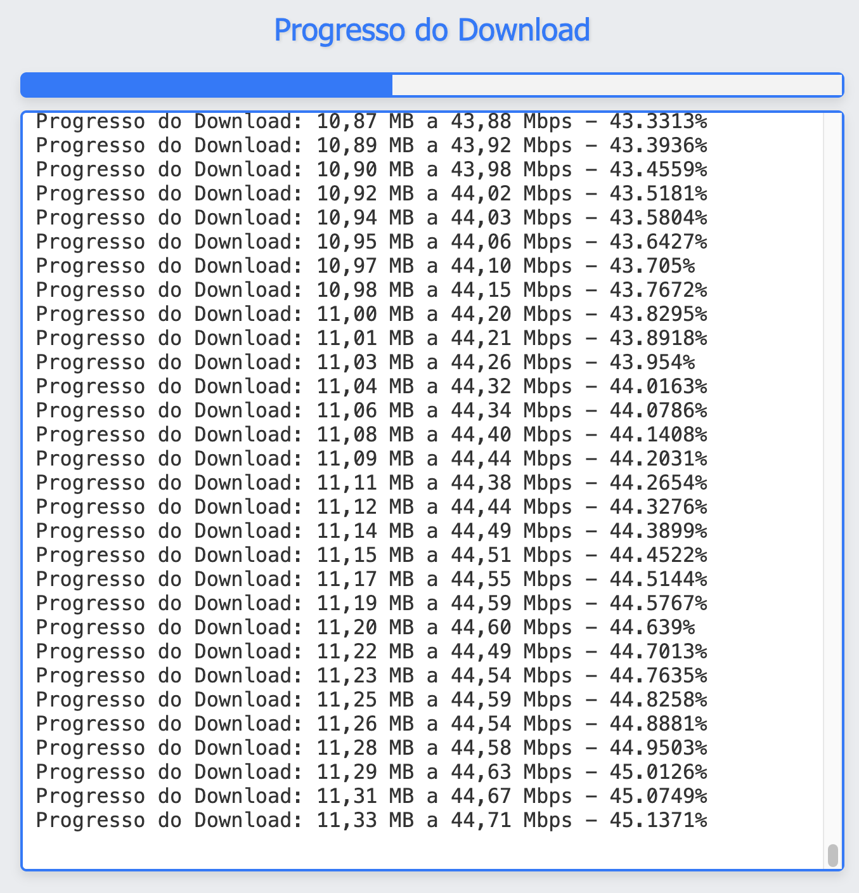

# Projeto InternetVelocityTestWithUI

## Descrição
O projeto **InternetVelocityTestWithUI** é uma aplicação com interface gráfica que permite realizar testes de velocidade de download e upload utilizando a biblioteca `jspeedtest`. A interface foi projetada para ser intuitiva e monitorar o progresso dos testes em tempo real, fornecendo relatórios detalhados sobre o desempenho da conexão à internet de maneira visual e acessível.

## Dependências
O projeto utiliza a seguinte dependência no arquivo `pom.xml`:

```xml
<!-- JSpeedtest Test Library -->
<dependency>
    <groupId>fr.bmartel</groupId>
    <artifactId>jspeedtest</artifactId>
    <version>1.32.1</version>
</dependency>

<!-- Spring Boot Starter Thymeleaf -->
<dependency>
    <groupId>org.springframework.boot</groupId>
    <artifactId>spring-boot-starter-thymeleaf</artifactId>
</dependency>

<!-- Spring Boot Starter WebSocket -->
<dependency>
    <groupId>org.springframework.boot</groupId>
    <artifactId>spring-boot-starter-websocket</artifactId>
</dependency>

```

## Estrutura do projeto
- **application**: `InternetVelocityTestApplication.java`
- **config**: `WebSocketConfig.java`
- **controller**: `SpeedTestController.java`
- **service**: `SpeedTestService.java`
- **resources/static/css**: `style.css`
- **resources/static/js**: `script.js`
- **resources/templates**: `download.html`
- **resources/templates**: `upload.html`

```
InternetVelocityTestWithUI  
├── src  
│   ├── main  
│   │   ├── java  
│   │   │   └── com  
│   │   │       └── example  
│   │   │           └── InternetVelocityTest  
│   │   │               ├── application  
│   │   │               │   └── InternetVelocityTestApplication.java  
│   │   │               ├── config  
│   │   │               │   └── WebSocketConfig.java  
│   │   │               ├── controller  
│   │   │               │   └── SpeedTestController.java  
│   │   │               └── service  
│   │   │                   └── SpeedTestService.java  
│   │   └── resources  
│   │       ├── static  
│   │       │   ├── css  
│   │       │   │   └── style.css  
│   │       │   └── js  
│   │       │       └── script.js
│   │       └── templates  
│   │           ├── download.html  
│   │           └── upload.html  
```

## Sobre a jspeedtest
A biblioteca jspeedtest é um cliente de teste de velocidade para Java/Android com suporte a HTTP e FTP. As funcionalidades incluem:
- Teste de velocidade de download
- Teste de velocidade de upload
- Monitoramento do progresso de download/upload
- Hostname/port/uri configurável (usuário e senha para FTP)
- Timeout de socket e tamanho de chunk configuráveis
- Armazenamento de arquivo de upload configurável

### Bibliotecas externas da jspeedtest
- [http-endec](https://github.com/bertrandmartel/http-endec)
- [http-endec - mvnrepository](https://mvnrepository.com/artifact/fr.bmartel/http-endec/1.04)
- [Apache Commons Net](https://commons.apache.org/proper/commons-net/)

## Links úteis
- [Central de artefatos Sonatype](https://central.sonatype.com/artifact/fr.bmartel/jspeedtest)
- [Maven Repository](https://mvnrepository.com/artifact/fr.bmartel/jspeedtest/1.32.1)
- [Repositório GitHub](https://github.com/bertrandmartel/speed-test-lib)

## Arquivo de teste
Para realizar os testes, foi escolhido um arquivo de vídeo WMV de 25 MB.

Link do arquivo de teste: [25MB-WMV.wmv](https://sampletestfile.com/wp-content/uploads/2023/07/25MB-WMV.wmv)

### Thymeleaf

Thymeleaf é um motor de templates para Java que permite a criação de páginas HTML dinâmicas de forma simples e eficiente. Ele é frequentemente utilizado em aplicações Spring, proporcionando uma maneira intuitiva de gerar conteúdo HTML e manipular dados diretamente nas páginas.

**Principais Características**

- **Natural Templating**: Os templates Thymeleaf são válidos como documentos HTML, permitindo que sejam visualizados em navegadores sem processamento.
- **Integração com Spring**: Thymeleaf se integra perfeitamente com o Spring Framework, facilitando a injeção de dependências e o acesso a beans do Spring.
- **Expressões de Template**: Utiliza uma sintaxe simples e expressiva para manipular dados, permitindo a criação de lógicas condicionais e loops diretamente nas páginas.

## Interface Gráfica

A interface gráfica permite que o usuário insira o link do vídeo, visualize e inicie o download com um clique. Para usar, basta iniciar o programa e colar o link do YouTube no campo designado.

### Captura de Tela

- **Tela de Download**: Contém o TextArea para exibir as informações sobre o teste de velocidade.

|  |
|:------------------------:|
|         Download         |

- Exemplo de resultado final: Download completo: 25,09 MB em 00:00:03 segundos a 57,18 Mbps
- Obs.: A tela de upload segue o mesmo padrão.

**Exemplo de Uso**

Aqui está um exemplo simples de um template Thymeleaf:

```html
<!DOCTYPE html>
<html xmlns:th="http://www.thymeleaf.org">
<head>
    <title>Exemplo Thymeleaf</title>
</head>
<body>
    <h1 th:text="${titulo}">Título do Documento</h1>
    <ul>
        <li th:each="item : ${itens}" th:text="${item}"></li>
    </ul>
</body>
</html>
```

Neste exemplo, o título e a lista de itens são preenchidos dinamicamente com dados fornecidos pelo controlador Spring.

Thymeleaf é uma escolha poderosa para desenvolvedores que desejam criar interfaces web dinâmicas e interativas em aplicações Java. Com sua sintaxe intuitiva e forte integração com o Spring, ele se tornou uma ferramenta popular no ecossistema de desenvolvimento Java.

### Funcionalidade da Barra de Progresso

A barra de progresso é um componente visual que fornece feedback em tempo real sobre o estado de um upload, exibindo a porcentagem de conclusão. Esta funcionalidade é implementada utilizando WebSockets para comunicação assíncrona entre o cliente (navegador) e o servidor.

### Como Funciona

1. **Conexão via WebSocket**:
   - A aplicação utiliza a biblioteca SockJS para estabelecer uma conexão WebSocket com o servidor. Isso permite que o cliente receba atualizações em tempo real sem a necessidade de recarregar a página.
   - Após a conexão ser estabelecida, o cliente se inscreve em um tópico específico (`/topic/speedtest`), onde o servidor publica mensagens sobre o progresso do upload.

2. **Recebendo Mensagens**:
   - Quando o servidor envia uma mensagem ao cliente, um callback é acionado. Esta mensagem geralmente contém informações sobre o progresso do upload, que podem incluir a porcentagem de conclusão.

3. **Atualizando a Barra de Progresso**:
   - O código JavaScript analisa o conteúdo da mensagem recebida, buscando uma correspondência que contenha uma porcentagem (exemplo: `75%`).
   - A expressão regular `/(\d+(\.\d+)?)%/` é usada para extrair o número que representa a porcentagem:
     - `\d+` captura um ou mais dígitos.
     - `(\.\d+)?` permite que exista uma parte decimal (opcional).
     - `%` indica que estamos procurando por uma string que termina com o símbolo de porcentagem.
   - Se uma correspondência for encontrada, o valor da barra de progresso (`progressBar.value`) é atualizado para refletir o progresso atual do upload.

4. **Visualização**:
   - A barra de progresso é representada por um elemento HTML `<progress>` com atributos que definem seu valor máximo e atual. À medida que o upload avança, a barra é preenchida visualmente, permitindo que os usuários vejam claramente o quanto do upload foi concluído.

### Benefícios

- **Feedback Visual**: Fornece uma indicação clara e imediata do progresso do upload, melhorando a experiência do usuário.
- **Interatividade em Tempo Real**: Graças à comunicação via WebSocket, os usuários recebem atualizações em tempo real, sem necessidade de recarregar a página.
- **Clareza**: Permite que os usuários compreendam rapidamente o status do upload, aumentando a eficiência e a satisfação.

### WebSocket no Spring Boot

O **WebSocket** é um protocolo de comunicação bidirecional que permite uma troca contínua de dados entre o cliente e o servidor sem a necessidade de realizar múltiplas requisições HTTP. Essa comunicação ocorre através de uma única conexão persistente, ideal para aplicações que exigem **atualizações em tempo real**, como chats, notificações e sistemas de monitoramento.

Essa dependência fornece as ferramentas e as bibliotecas necessárias para criar, configurar e gerenciar conexões WebSocket dentro do ambiente Spring Boot. Com ela, é possível facilmente implementar endpoints WebSocket e habilitar comunicação assíncrona no aplicativo.

## Como testar a aplicação
Para testar a aplicação, utilize os seguintes endpoints:

- **Download Speed Test**: http://localhost:8080/speed-test/download
- **Upload Speed Test**: http://localhost:8080/speed-test/upload

## Endpoints
- `GET /speed-test/download`
- Direciona para a página resources/templates/download.html

- `GET /speed-test/upload`
- Direciona para a página resources/templates/upload.html

## Métodos do SpeedTestService
Os métodos disponíveis no `SpeedTestService` são:
- `public void startDownloadSpeedTest()`: Inicia o teste de velocidade de download.
- `public void startUploadSpeedTest()`: Inicia o teste de velocidade de upload.
- `startSpeedTest(boolean isDownload)`: Método auxiliar para iniciar o teste de velocidade, determinando se é download ou upload.
- `logCompletion(SpeedTestReport report, boolean isDownload)`: Registra a conclusão do teste, salvando o relatório.
- `logProgress(SpeedTestReport report, float percent, boolean isDownload)`: Registra o progresso do teste, atualizando o relatório.
- `String formatDuration(double seconds)`: Formata a duração do teste em um formato legível.

## Licença

Este projeto é de código aberto e está licenciado sob a MIT License. Sinta-se livre para usá-lo e modificá-lo conforme necessário.
