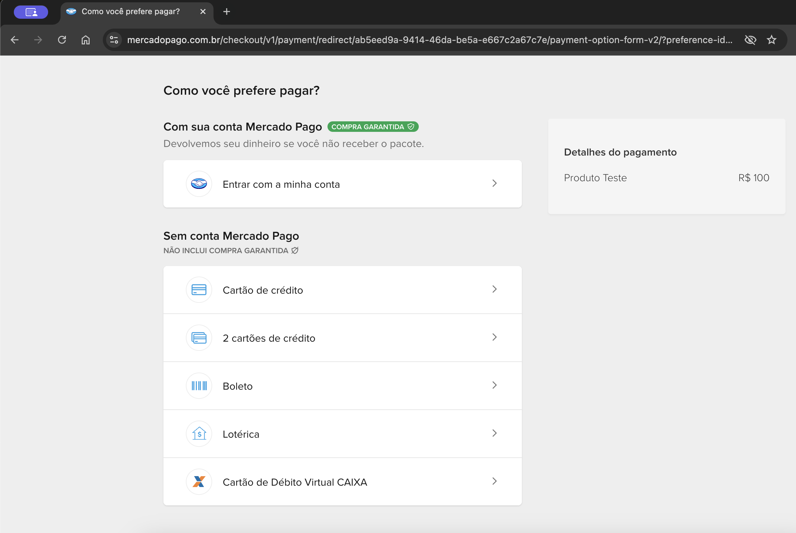
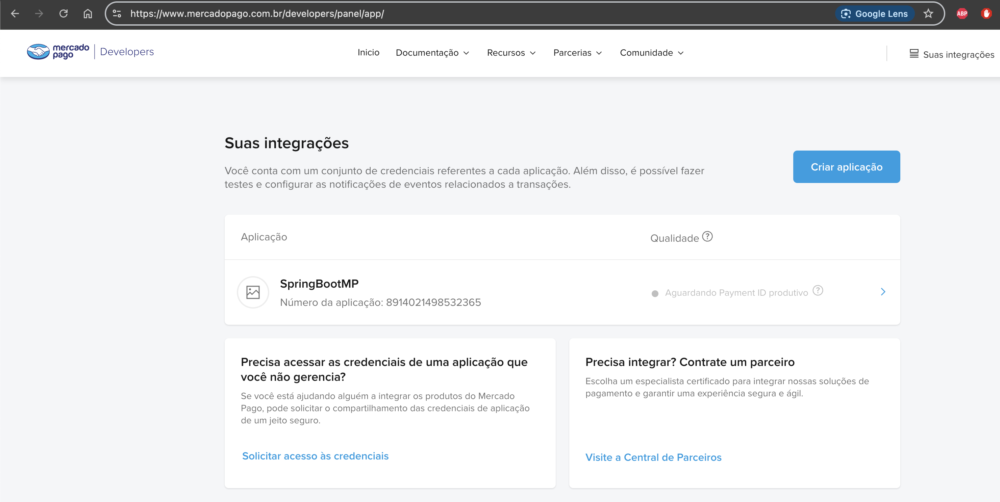
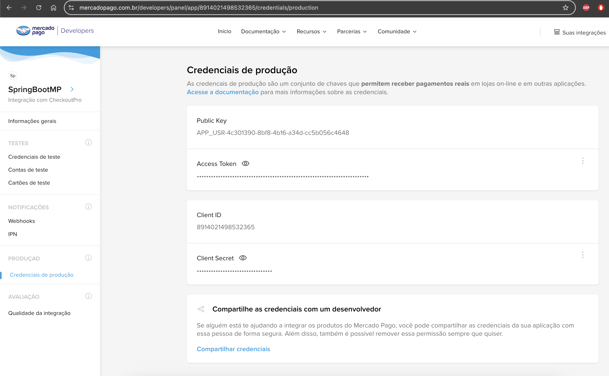
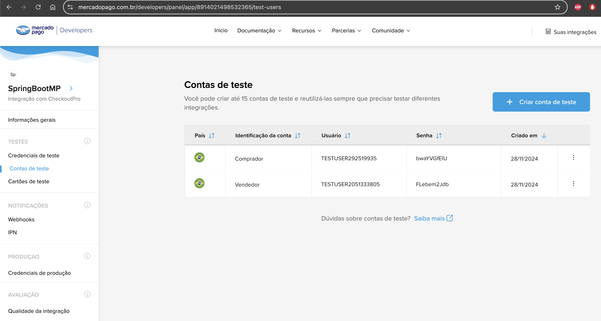
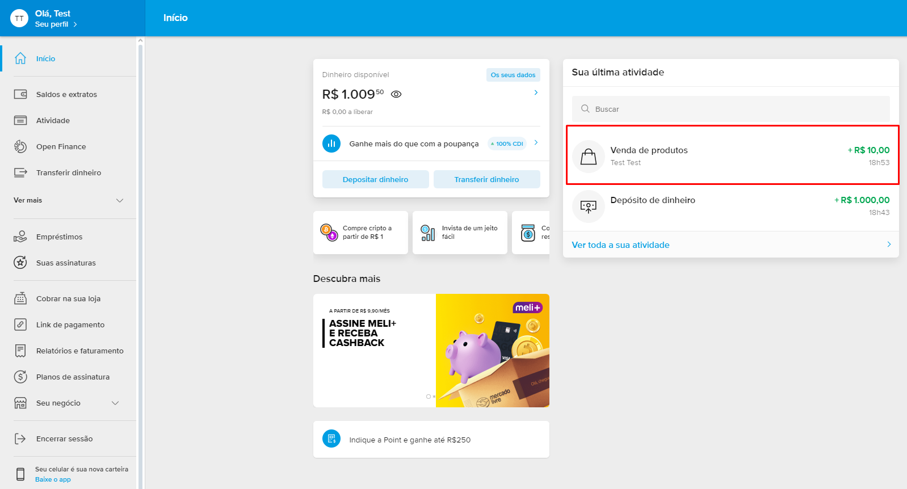

# MP_Checkout_Pro

O projeto **MP_Checkout_Pro** é uma implementação de integração com o Mercado Pago utilizando o **Checkout Pro**.
Ele permite criar preferências de pagamento e redirecionar o cliente para o fluxo de pagamento seguro do Mercado Pago.

## Capturas de Tela

- **Tela Mercado Pago**: O link gerado pelo controller redireciona para esta tela.

|  |
|:-------------------:|
| Tela Mercado Pago |

- **Tela Suas integrações**: Para criar a aplicação.

|  |
|:---------------------:|
| Tela Suas integrações |

- **Tela Credenciais de produção**: Para obter o Access Token.

|  |
|:----------------------------:|
| Tela Credenciais de produção |

- **Tela Contas de teste**: Para criar contas fictícias de vendedor e comprador.

|  |
|:--------------------:|
| Tela Contas de teste |

- **Tela Vendedor (fictício)**: Exibe o saldo atual e a venda realizada (R$ 10,00 neste exemplo com taxa de serviço de R$0,50).

|  |
|:------------------------:|
| Tela Vendedor (fictício) |

## Dependências

Certifique-se de adicionar a seguinte dependência ao seu arquivo `pom.xml`:

```xml
<dependency>
    <groupId>com.mercadopago</groupId>
    <artifactId>sdk-java</artifactId>
    <version>2.1.29</version>
</dependency>
```

## Estrutura do Projeto

O projeto segue a seguinte estrutura de diretórios:

```
/MP_Checkout_Pro
│
├── src
│   ├── main
│   │   ├── java
│   │   │   └── com
│   │   │       └── exemplo
│   │   │           └── MP_Checkout_Pro
│   │   │               ├── application
│   │   │               │   └── MpCheckoutProApplication.java
│   │   │               ├── config
│   │   │               │   └── ApiConfig.java
│   │   │               ├── controller
│   │   │               │   └── MpCheckoutProController.java
│   │   │               └── service
│   │   │                   └── MpCheckoutProService.java
```

## Endpoints

### GET /iniciar-pagamento

Este endpoint permite iniciar um pagamento criando uma preferência no Mercado Pago. 

#### Parâmetros:

- **titulo**: Nome do produto.
- **quantidade**: Quantidade do produto.
- **precoUnitario**: Preço unitário do produto.

#### Exemplo de Chamada:

- **titulo**: Produto Teste
- **quantidade**: 1
- **precoUnitario**: 100.00 (R$ 100,00 neste exemplo)

```
http://localhost:8080/iniciar-pagamento?titulo=Produto+Teste&quantidade=1&precoUnitario=100.00
```

#### Exemplo de Resposta:

```
https://www.mercadopago.com.br/checkout/v1/redirect?pref_id=50756373-120c20cd-291e-4409-9d6c-7c967d77d6e1
```

## Serviço - Detalhes

A classe `MpCheckoutProService` é responsável pela lógica de criação de preferências de pagamento no Mercado Pago. 

1. **Configuração Inicial**: Durante a inicialização do serviço, o token de acesso é configurado utilizando a classe `ApiConfig`.

2. **Criação de Preferência**:
   - Um objeto `PreferenceItemRequest` é criado para representar o item a ser vendido, contendo:
     - **Título**: Nome do produto.
     - **Quantidade**: Quantidade do produto.
     - **Preço Unitário**: Valor unitário do produto.
   - Esse item é então utilizado para criar uma requisição do tipo `PreferenceRequest`, que pode conter uma lista de itens.
   - A requisição é enviada para o Mercado Pago utilizando a classe `PreferenceClient`, que retorna uma instância de `Preference`.
   - O link gerado (chamado de **init point**) redireciona para a tela de pagamento do Mercado Pago.

## Contas de Teste - Mercado Pago Checkout Pro

Ao integrar o **Checkout Pro** do Mercado Pago, é essencial usar contas de teste para simular transações e garantir que tudo funcione como esperado antes de ir para produção.

### Contas de Vendedor e Comprador

O Mercado Pago fornece dois tipos de contas de teste:

1. **Conta de Teste - Vendedor**: Representa o lojista que está vendendo o produto/serviço.
2. **Conta de Teste - Comprador**: Representa o cliente que está comprando o produto/serviço.

Essas contas simulam transações sem custos financeiros reais.

### Criando Contas de Teste

Para criar contas de teste:

1. Acesse o [Painel de Aplicações](https://www.mercadopago.com.br/developers/panel/app/).
2. Escolha sua aplicação.
3. Vá até a seção **Credenciais**.
4. Clique na aba **Contas de Teste**.
5. Crie as contas de **vendedor** e **comprador** conforme necessário.

## Documentação e Links Úteis

- [Mercado Pago - Documentação Geral](https://www.mercadopago.com.br/developers/pt/docs)
- [Referência de API](https://www.mercadopago.com.br/developers/pt/reference)
- [Pagamentos Online](https://www.mercadopago.com.br/developers/pt/docs#online-payments)
- [Checkout Pro - Landing Page](https://www.mercadopago.com.br/developers/pt/docs/checkout-pro/landing)
- [Checkout Pro - Integração de Preferências](https://www.mercadopago.com.br/developers/pt/docs/checkout-pro/integrate-preferences)
- [Live Demo - Checkout Pro](https://www.mercadopago.com.br/developers/pt/live-demo/checkout-pro)
- [Vídeo Explicativo - Checkout Pro - Como gerar um access token](https://www.youtube.com/watch?v=WWcGuv74vbs)
- [Painel de Aplicações](https://www.mercadopago.com.br/developers/panel/app/)
- [SDK Mercado Pago no Maven](https://mvnrepository.com/artifact/com.mercadopago/sdk-java)

## Licença

Este projeto está licenciado sob a **MIT License**.
