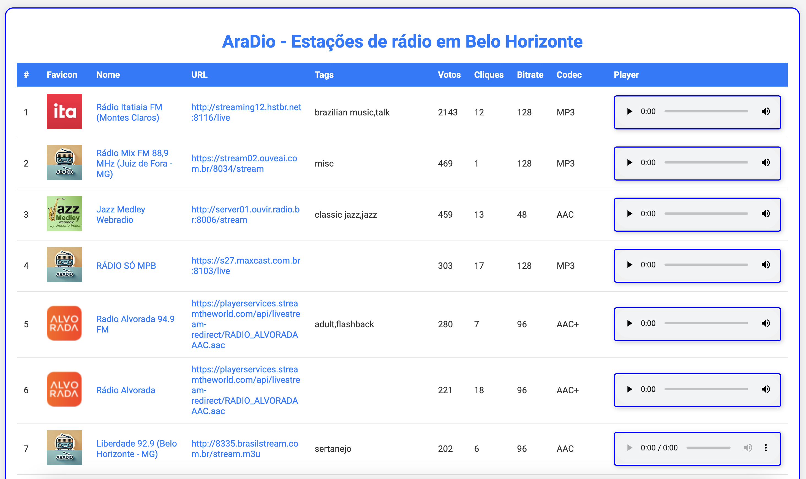

# RadioBrowserAPI

## Descrição do Projeto

O RadioBrowserAPI é um projeto que apresenta 90 estações de rádio de Belo Horizonte (BH). A aplicação permite que os usuários visualizem informações sobre as estações de rádio, incluindo detalhes como nome, URL, tags, votos, cliques, bitrate e codec. A interface é construída utilizando o Thymeleaf, que fornece uma maneira simples e eficiente de gerar páginas HTML dinâmicas.

No projeto RadioBrowserAPI, utilizamos HTML5 para criar uma interface web interativa e moderna. Uma das funcionalidades principais da aplicação é a reprodução de estações de rádio, que é possibilitada pelo uso da tag `<audio>` do HTML5.

A tag `<audio>` permite incorporar áudio diretamente nas páginas da web, oferecendo aos usuários a capacidade de ouvir as rádios de Belo Horizonte de forma simples e eficiente. Com essa tag, é possível incluir controles de reprodução, como play, pause e volume, proporcionando uma experiência de usuário intuitiva e acessível.

Graças à integração do Thymeleaf, a aplicação é capaz de gerar dinamicamente elementos de áudio para cada uma das 90 estações de rádio disponíveis, permitindo que os usuários selecionem e ouçam suas rádios favoritas com facilidade. A combinação do HTML5 e do Thymeleaf garante que a interface não apenas seja funcional, mas também responsiva e atraente.

## Captura de Tela

- **Home**: Exibe as 90 rádios recuperadas da cidade de Belo Horizonte

|  |
|:--------------------:|
|         Home         |

## Dependências

O projeto utiliza a seguinte dependência em seu `pom.xml`:

```xml
<dependency>
    <groupId>org.springframework.boot</groupId>
    <artifactId>spring-boot-starter-thymeleaf</artifactId>
</dependency>
```

### Thymeleaf

Thymeleaf é um motor de templates para Java que permite a criação de páginas HTML dinâmicas de forma simples e eficiente. Ele é frequentemente utilizado em aplicações Spring, proporcionando uma maneira intuitiva de gerar conteúdo HTML e manipular dados diretamente nas páginas.

**Principais Características**

- **Natural Templating**: Os templates Thymeleaf são válidos como documentos HTML, permitindo que sejam visualizados em navegadores sem processamento.
- **Integração com Spring**: Thymeleaf se integra perfeitamente com o Spring Framework, facilitando a injeção de dependências e o acesso a beans do Spring.
- **Expressões de Template**: Utiliza uma sintaxe simples e expressiva para manipular dados, permitindo a criação de lógicas condicionais e loops diretamente nas páginas.

## Estrutura do Projeto

/RadioBrowserAPI
```
│
├── src
│   ├── main
│   │   ├── java
│   │   │   └── com
│   │   │       └── exemplo
│   │   │           └── RadioBrowserAPI
│   │   │               ├── application
│   │   │               │   └── RadioBrowserApiApplication.java
│   │   │               ├── config
│   │   │               │   └── ApiConfig.java
│   │   │               ├── controller
│   │   │               │   └── RadioBrowserApiController.java
│   │   │               └── service
│   │   │                   └── RadioBrowserApiService.java
│   │   ├── resources
│   │   │   ├── application.properties
│   │   │   ├── static
│   │   │   │   └── css
│   │   │   │       └── style.css
│   │   │   │   └── imgs
│   │   │   │       └── aradio.webp
│   │   │   └── templates
│   │   │       └── home.html
│   └── test
│       └── java
│           └── com
│               └── exemplo
│                   └── RadioBrowserAPI
│                       └── RadioBrowserApiApplicationTests.java
│
├── pom.xml
├── README.md
```

## Endpoints

```java
@GetMapping("/")
public String listRadioStations(Model model) {
    List<RadioStation> radioStations = radioBrowserApiService.listRadioStations();
    model.addAttribute("stations", radioStations);
    return "home";
}
```

Acesse a página inicial em: [http://localhost:8080/](http://localhost:8080/)

**Informações da Home**

| #  | Favicon | Nome | URL | Tags | Votos | Cliques | Bitrate | Codec | Player |
|----|---------|------|-----|------|-------|---------|---------|-------|--------|

## Configuração

O arquivo `application.properties` contém as seguintes configurações:

```properties
spring.application.name=RadioBrowserAPI
radio.search.api.base.url=https://de1.api.radio-browser.info/json/stations/search
```

## Métodos do Serviço

- `List<RadioStation> listRadioStations()`
- `List<RadioStation> extractRadioStations(List<Map<String, Object>> stationsData)`

## Documentação e Links Úteis

- [API Radio Browser](https://api.radio-browser.info/)
- [Radio Browser](https://www.radio-browser.info/)
- [Estações de Rádio](https://de1.api.radio-browser.info/json/stations/search)
- [Estações em Minas Gerais, Belo Horizonte](https://de1.api.radio-browser.info/json/stations/search?country=Brazil&state=Minas%20Gerais&city=Belo%20Horizonte)
- [Estação Itatiaia](https://de1.api.radio-browser.info/json/stations/search?name=itatiaia)

## Licença

Este projeto está licenciado sob a MIT License.
