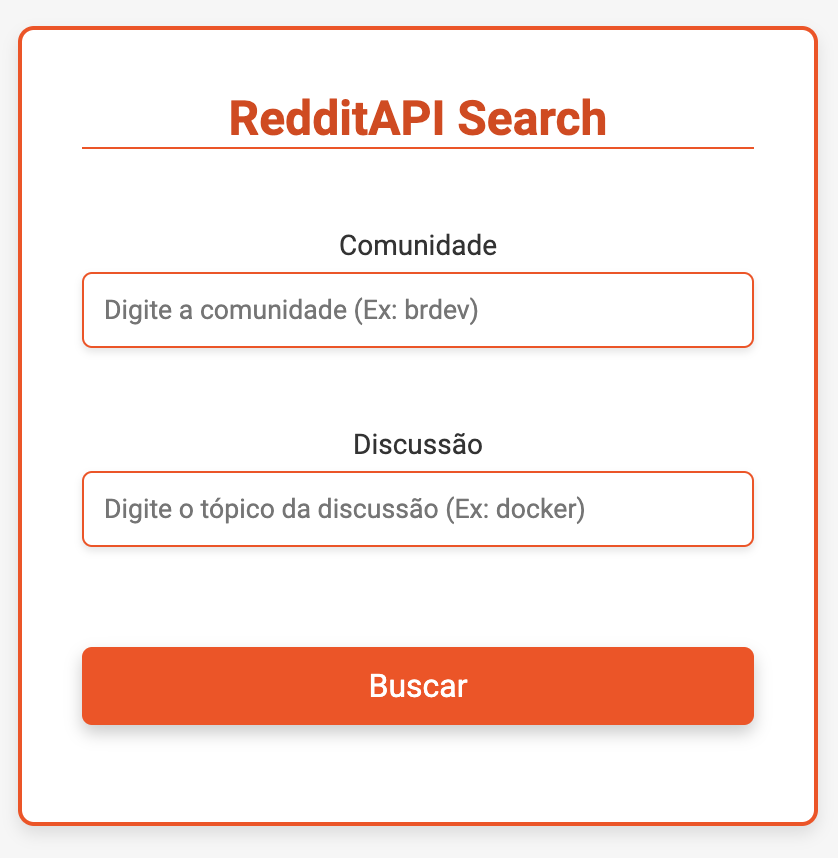
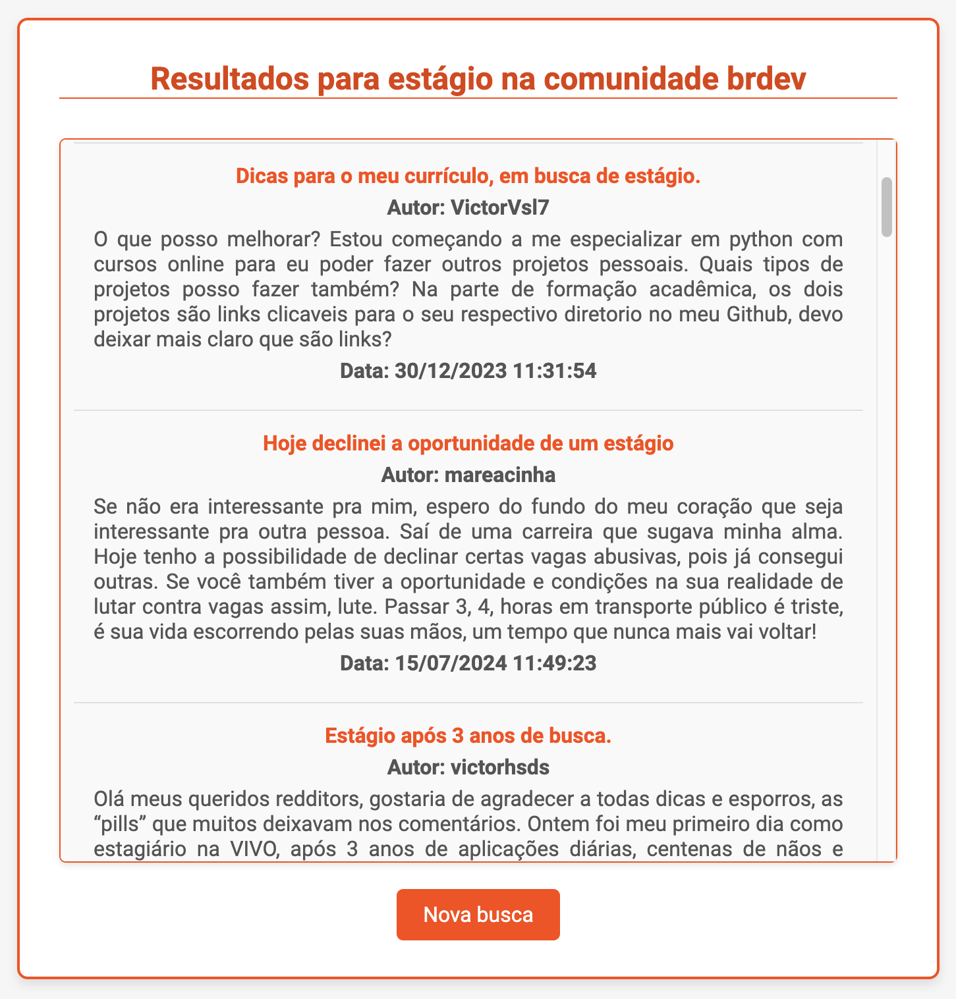

# Projeto RedditAPIWithUI

Este projeto implementa uma API para busca de discussões no Reddit, utilizando a API do Reddit para retornar informações relevantes sobre tópicos discutidos nas comunidades. Agora, o projeto conta com uma interface gráfica que inclui duas páginas: `home.html` e `result.html`.

Na página `home.html`, os usuários podem realizar suas buscas, enquanto a página `result.html` exibe os resultados da pesquisa, incluindo:

- O título da discussão
- O link para o Reddit
- O autor
- O texto
- A data da postagem

A interface gráfica proporciona uma experiência de usuário mais intuitiva e interativa, facilitando a exploração das discussões do Reddit.

## Capturas de Tela

- **Tela Inicial - Home**: Campos para inserir a comunidade e a discussão.
- **Tela de Resultados**: Exibe o resultado da pesquisa com um botão de nova busca que permite ao usuário retornar à página inicial.

|  |  |
|:--:|:--:|
| Tela Inicial - Home | Tela de Resultados |

## Estrutura do Projeto
```
src
├── main
│   ├── java
│   │   └── com
│   │       └── example
│   │           └── RedditAPIWithUI
│   │               ├── application
│   │               │   └── RedditApiWithUIApplication.java
│   │               ├── config
│   │               │   └── ApiConfig.java
│   │               ├── controller
│   │               │   └── RedditApiWithUIController.java
│   │               ├── model
│   │               │   └── Discussion.java
│   │               └── service
│   │                   └── RedditApiWithUIService.java
│   └── resources
│       ├── static
│       │   └── css
│       │       └── style.css
│       └── templates
│           ├── home.html
│           └── result.html
```

## Dependências

pom.xml
```xml
<dependency>
    <groupId>org.springframework.boot</groupId>
    <artifactId>spring-boot-starter-thymeleaf</artifactId>
</dependency>
```

### Thymeleaf

Thymeleaf é um motor de templates para Java que permite a criação de páginas HTML dinâmicas de forma simples e eficiente. Ele é frequentemente utilizado em aplicações Spring, proporcionando uma maneira intuitiva de gerar conteúdo HTML e manipular dados diretamente nas páginas.

**Principais Características**

- **Natural Templating**: Os templates Thymeleaf são válidos como documentos HTML, permitindo que sejam visualizados em navegadores sem processamento.
- **Integração com Spring**: Thymeleaf se integra perfeitamente com o Spring Framework, facilitando a injeção de dependências e o acesso a beans do Spring.
- **Expressões de Template**: Utiliza uma sintaxe simples e expressiva para manipular dados, permitindo a criação de lógicas condicionais e loops diretamente nas páginas.

## Endpoints

1. **Home Endpoint**
   - **Método HTTP:** GET
   - **Caminho:** /
   - **Descrição:** Este endpoint é responsável por renderizar a página inicial do aplicativo. Ao acessar a raiz do aplicativo, os usuários são apresentados com a interface gráfica em `home.html`, onde podem iniciar a busca por discussões.

Exemplo: http://localhost:8080/

2. **Search Discussions Endpoint**
   - **Método HTTP:** GET
   - **Caminho:** /result
   - **Descrição:** Este endpoint é utilizado para buscar discussões no Reddit. Os usuários podem enviar uma consulta (query) e, opcionalmente, especificar uma comunidade (community). Os resultados da pesquisa serão processados e os dados relevantes, como o texto da discussão, o autor, a data, o título e o link para o Reddit, serão retornados para a página `result.html`, onde serão apresentados ao usuário.

Exemplo: http://localhost:8080/result?community=brdev&query=emprego

### Parâmetros
- **community (opcional):** O nome da comunidade no Reddit onde a busca será realizada.
- **query (obrigatório):** A palavra-chave ou frase que os usuários desejam pesquisar nas discussões do Reddit.

## Métodos de Serviço

1. **searchDiscussions**
   - **Descrição:** Este método realiza uma busca de discussões no Reddit com base em uma consulta fornecida. Ele constrói a URL de busca, que inclui a consulta e o critério de ordenação por relevância. Em seguida, utiliza o `RestTemplate` para fazer uma requisição GET à API do Reddit. A resposta recebida, que está no formato JSON, é processada pelo método `extractDiscussions` para extrair as informações relevantes sobre as discussões.

2. **searchDiscussionsByCommunity**
   - **Descrição:** Semelhante ao método anterior, este método permite a busca de discussões em uma comunidade específica do Reddit. Ele também constrói a URL de busca, mas inclui o nome da comunidade na URL. Após realizar a requisição GET, a resposta JSON é passada para o método `extractDiscussions`, que retorna uma lista de discussões correspondentes à consulta e à comunidade especificada.

3. **extractDiscussions**
   - **Descrição:** Este método é responsável por processar a resposta JSON recebida da API do Reddit. Ele verifica se os dados esperados estão presentes na resposta. Em caso afirmativo, itera sobre as discussões encontradas, extraindo informações como o título, a URL, o autor, o texto da discussão e a data de criação. A data é convertida de milissegundos para um formato legível. Por fim, as informações extraídas são usadas para criar objetos do tipo `Discussion`, que são adicionados a uma lista e retornados.

### Resumo
Esses métodos juntos permitem a interação com a API do Reddit, facilitando a busca de discussões tanto de forma geral quanto dentro de comunidades específicas, e organizando as informações em objetos que podem ser utilizados na interface do usuário.

## Links Úteis

- [Documentação da API do Reddit](https://www.reddit.com/dev/api)
- [API de busca do Reddit](https://www.reddit.com/dev/api#GET_search)
- [Subreddit brdev](https://www.reddit.com/r/brdev/)
- [Busca por 'engenharia%20de%20software'](https://www.reddit.com/r/brdev/search.json?q=engenharia%20de%20software)
- [Configurações de aplicativos Reddit](https://www.reddit.com/prefs/apps/)

## Licença

Este projeto está licenciado sob a MIT License.
