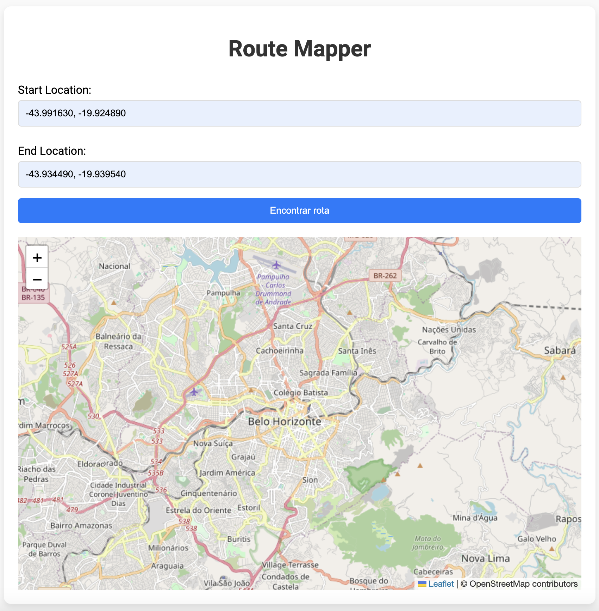
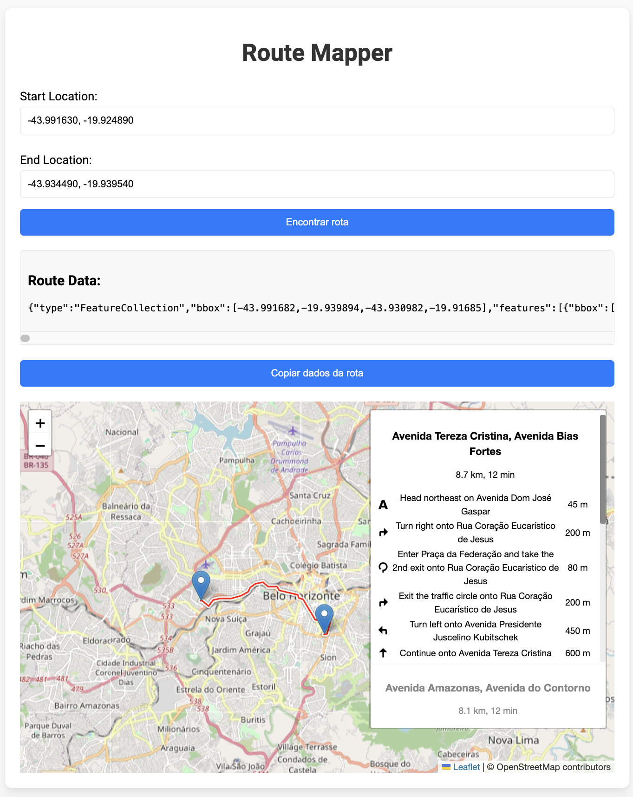

# Projeto RouteMapper

## Descrição

**RouteMapper** é uma aplicação web construída com **Spring Boot** que utiliza o **Thymeleaf** para renderização do front-end. O objetivo do projeto é permitir que os usuários informem as coordenadas geográficas de um ponto de partida e um ponto de chegada, para que seja gerada a rota entre esses dois pontos. A rota é visualizada em um mapa interativo utilizando a biblioteca **Leaflet**.

### Funcionalidades
- O usuário pode inserir as coordenadas de longitude e latitude para o ponto de partida e o ponto de chegada.
- A aplicação utiliza a API do **OpenRouteService** para calcular a melhor rota entre os dois pontos.
- O resultado da rota é exibido em tempo real no mapa interativo, utilizando a **Leaflet Routing Machine**, que é uma extensão da biblioteca **Leaflet** para visualização de rotas em mapas.
  
### OpenRouteService
O **OpenRouteService** é uma API que fornece uma série de serviços geoespaciais, incluindo roteamento, geocodificação, isócronas, entre outros. No contexto deste projeto, ele é utilizado para calcular as rotas entre o ponto de origem e o ponto de destino. A API permite o uso de diferentes modos de transporte, como carro, bicicleta e pedestre, além de fornecer informações detalhadas sobre o trajeto, como distância e tempo estimado.

- A API é acessada via uma chave de autenticação (API Key) que é passada como parâmetro na URL para fazer a solicitação da rota.
  
### Leaflet Routing Machine
A **Leaflet Routing Machine** é uma biblioteca JavaScript que facilita a criação de rotas em mapas interativos baseados no **Leaflet**. Ela permite adicionar facilmente um controle de roteamento ao mapa, que pode gerar rotas entre dois ou mais pontos. O controle também fornece funcionalidades como:
- Ajuste automático da visualização do mapa para cobrir a área da rota.
- Adição de marcadores de origem e destino.
- Capacidade de arrastar a rota diretamente no mapa.

### Documentação e links úteis
- [OpenRouteService](https://openrouteservice.org/)
- [ApiToken](https://openrouteservice.org/dev/#/home)

## Capturas de Tela

### Home



### Resultado



## Dependências
As dependências principais do projeto são:

- `spring-boot-starter-thymeleaf`: Para a renderização do front-end utilizando o Thymeleaf.

## Estrutura do Projeto

A estrutura do projeto está organizada da seguinte forma:

```
com.example.RouteMapper
│
├── application
│   └── RouteMapperApplication.java
│
├── config
│   └── ApiConfig.java
│
├── controller
│   └── RouteMapperController.java
│
└── service
    └── RouteMapperService.java
resources
├── static
│   └── css
│       └── style.css
└── templates
    └── home.html
```

## Página Inicial (home.html)

O arquivo `home.html` contém um formulário onde os usuários podem informar as coordenadas de início e fim para gerar a rota. O formulário é processado pelo backend, que retorna os dados da rota para exibição na interface.

Exemplo do formulário:

```html
<form th:action="@{/route}" method="get">
    <label for="start">Start Location:</label>
    <input type="text" id="start" name="start" placeholder="Longitude, Latitude" required th:value="${start}">
    <label for="end">End Location:</label>
    <input type="text" id="end" name="end" placeholder="Longitude, Latitude" required th:value="${end}">
    <button type="submit">Encontrar rota</button>
</form>
```

## Endpoints

### Página Inicial

A URL principal para acessar a página inicial é:

```
http://localhost:8080/
```

### Obter Rota

A URL para obter a rota entre dois pontos é:

```
http://localhost:8080/route?start={start}&end={end}
```

Onde **start** e **end** são as coordenadas geográficas no formato `Longitude, Latitude`.

### Exemplo

Um exemplo de URL com coordenadas para gerar a rota:

```
http://localhost:8080/route?start=-43.991630%2C+-19.924890&end=-43.934490%2C+-19.939540
```

## Lógica do Serviço

A lógica de cálculo da rota é realizada no serviço `RouteMapperService`, que utiliza a API OpenRouteService para calcular a rota entre os dois pontos. O código do serviço é o seguinte:

```java
public String getRoute(String start, String end) {
    String apiUrl = String.format(
            "https://api.openrouteservice.org/v2/directions/driving-car?api_key=%s&start=%s&end=%s",
            apiConfig.getApiKey(),
            start,
            end
    );

    RestTemplate restTemplate = new RestTemplate();
    return restTemplate.getForObject(apiUrl, String.class);
}
```

As coordenadas de **start** e **end** são passadas no formato `longitude,latitude`, e a API retorna os dados da rota.

## Licença

Este projeto está licenciado sob a MIT License.
