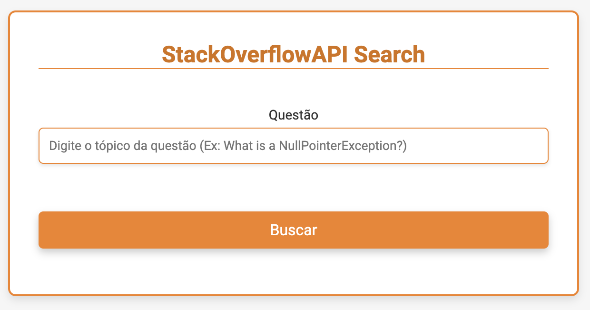
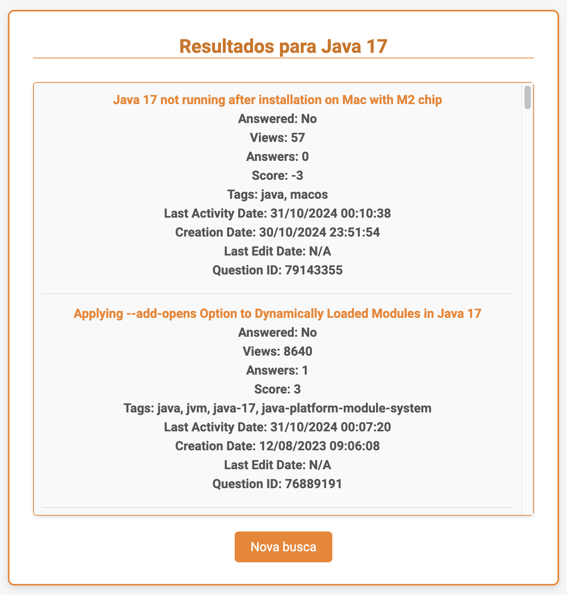

# Projeto StackOverflowAPIWithUI

Este projeto implementa uma API para busca de perguntas no Stack Overflow, utilizando a API do Stack Exchange para retornar informações relevantes sobre questões discutidas na plataforma. O projeto conta com uma interface gráfica que inclui duas páginas: `home.html` e `result.html`.

Na página `home.html`, os usuários podem realizar suas buscas, enquanto a página `result.html` exibe os resultados da pesquisa, incluindo:

- O título da pergunta
- O link para o Stack Overflow
- As tags associadas
- O status de resposta
- O número de visualizações
- O número de respostas
- A pontuação
- A data da última atividade
- A data de criação
- A data da última edição

A interface gráfica proporciona uma experiência de usuário mais intuitiva e interativa, facilitando a exploração das perguntas do Stack Overflow.

## Funcionalidades

- **Buscar perguntas**: Realiza buscas no Stack Overflow com base em palavras-chave fornecidas.
- **Filtrar por tags**: Permite filtrar os resultados utilizando tags específicas.
- **Ordenar resultados**: Ordena as perguntas por relevância ou data de criação.
- **Consultar detalhes**: Exibe informações detalhadas, como título, link, número de respostas e pontuação das perguntas.
- **Controle de Cota**: Monitora e gerencia o uso da cota diária da API para evitar excedentes.

## Capturas de Tela

- **Tela Inicial - Home**: Campo para inserir a busca por perguntas e botão para realizar a pesquisa.
- **Tela de Resultados**: Exibe o resultado da pesquisa com um botão de nova busca que permite ao usuário retornar à página inicial.

|  |  |
|:--:|:--:|
| Tela Inicial - Home | Tela de Resultados |

## Estrutura do Projeto

/StackOverflowAPI
```
│
├── src
│   ├── main
│   │   ├── java
│   │   │   └── com
│   │   │       └── exemplo
│   │   │           └── StackOverflowAPIWithUI
│   │   │               ├── application
│   │   │               │   └── StackOverflowApiWithUIApplication.java
│   │   │               ├── config
│   │   │               │   └── ApiConfig.java
│   │   │               ├── controller
│   │   │               │   └── StackOverflowApiWithUIController.java
│   │   │               └── service
│   │   │                   └── StackOverflowApiWithUIService.java
│   │   ├── resources
│   │   │   ├── application.properties
│   │   │   ├── static
│   │   │   │   └── css
│   │   │   │       └── style.css
│   │   │   └── templates
│   │   │       ├── home.html
│   │   │       └── result.html
│   └── test
│       └── java
│           └── com
│               └── exemplo
│                   └── StackOverflowAPIWithUI
│                       └── StackOverflowApiWithUIApplicationTests.java
│
├── pom.xml
├── README.md

```

## Dependências

pom.xml
```xml
<dependency>
    <groupId>org.springframework.boot</groupId>
    <artifactId>spring-boot-starter-thymeleaf</artifactId>
</dependency>
```

### Thymeleaf

Thymeleaf é um motor de templates para Java que permite a criação de páginas HTML dinâmicas de forma simples e eficiente. Ele é frequentemente utilizado em aplicações Spring, proporcionando uma maneira intuitiva de gerar conteúdo HTML e manipular dados diretamente nas páginas.

**Principais Características**

- **Natural Templating**: Os templates Thymeleaf são válidos como documentos HTML, permitindo que sejam visualizados em navegadores sem processamento.
- **Integração com Spring**: Thymeleaf se integra perfeitamente com o Spring Framework, facilitando a injeção de dependências e o acesso a beans do Spring.
- **Expressões de Template**: Utiliza uma sintaxe simples e expressiva para manipular dados, permitindo a criação de lógicas condicionais e loops diretamente nas páginas.

## Endpoints

1. **Home Endpoint**
   - **Método HTTP:** GET
   - **Caminho:** /
   - **Descrição:** Este endpoint é responsável por renderizar a página inicial do aplicativo. Ao acessar a raiz do aplicativo, os usuários são apresentados com a interface gráfica em `home.html`, onde podem iniciar a busca por perguntas.

Exemplo: http://localhost:8080/

2. **Search Questions Endpoint**
   - **Método HTTP:** GET
   - **Caminho:** /result
   - **Descrição:** Este endpoint é utilizado para buscar questões no StackOverflow. Os usuários podem enviar uma consulta (query) e recuperar as perguntas sobre aquele assunto. Os resultados da pesquisa serão processados e os dados relevantes, como o texto da pergunta, o link e as datas, serão retornados para a página `result.html`, onde serão apresentados ao usuário.

Exemplo local: http://localhost:8080/result?query=Java+17

Exemplo no Stack Overflow: https://stackoverflow.com/questions/218384/what-is-a-nullpointerexception-and-how-do-i-fix-it

### Parâmetros
- **query (obrigatório):** A palavra-chave ou frase que os usuários desejam pesquisar nas questões do StackOverflow.

## Métodos de Serviço

1. **searchQuestions**
   - **Descrição:** Este método realiza uma busca de questõe no StackOverflow com base em uma consulta fornecida. Ele constrói a URL de busca, que inclui a consulta e o critério de ordenação por relevância. Em seguida, utiliza o `RestTemplate` para fazer uma requisição GET à API do StackOverflow. A resposta recebida, que está no formato JSON, é processada pelo método `extractQuestions` para extrair as informações relevantes sobre as questões.

2. **extractQuestions**
   - **Descrição:** Este método é responsável por processar a resposta JSON recebida da API do StackOverflow. Ele verifica se os dados esperados estão presentes na resposta. Em caso afirmativo, itera sobre as questões encontradas, extraindo informações como o texto da pergunta, o link e as datas. As datas são convertidas de milissegundos para um formato legível. Por fim, as informações extraídas são usadas para criar objetos do tipo `Question`, que são adicionados a uma lista e retornados.

### Resumo
Esses métodos juntos permitem a interação com a API do StackOverflow, facilitando a busca de questões e organizando as informações em objetos que podem ser utilizados na interface do usuário.

## Links Úteis

- [Documentação da API do Stack Exchange](https://api.stackexchange.com/)
- [API de busca do Stack Overflow](https://api.stackexchange.com/docs/search)
- [Busca por 'nullpointerexception%20java'](https://api.stackexchange.com/2.3/search?order=desc&sort=activity&site=stackoverflow&intitle=nullpointerexception%20java)
- [Stack apps](https://stackapps.com/users/login)

## Licença

Este projeto está licenciado sob a MIT License.
