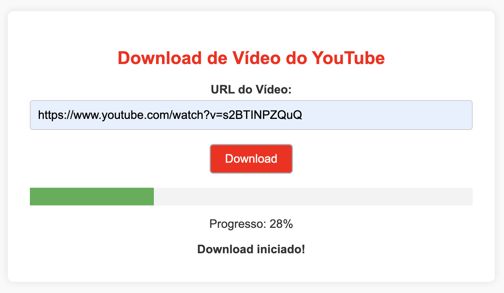

# YouTube Video Downloader With UI And Progress Bar

Este é um projeto simples para baixar vídeos do YouTube utilizando a biblioteca `yt_dlp`, uma ferramenta poderosa que facilita o download de vídeos na melhor qualidade disponível.

## Funcionalidade

O projeto agora inclui uma interface gráfica na página inicial, permitindo que os usuários coletem a URL do vídeo do YouTube diretamente em um formulário. O vídeo será baixado e salvo com o título original, e os usuários poderão iniciar o download clicando em um botão. Além disso, foi adicionada uma barra de progresso que fornece feedback em tempo real sobre o estado do download, permitindo que os usuários acompanhem a porcentagem de conclusão do processo de download.

## Como Usar

1. Acesse a página inicial do aplicativo em `http://localhost:8080/`.
2. Cole a URL do vídeo do YouTube no campo fornecido.
3. Clique no botão "Download" para iniciar o download do vídeo.

## Estrutura do Projeto
```
application
└── YouTubeVideoDownloaderApplication.java
controller
├── ProgressController.java
└── YouTubeVideoDownloaderController.java
service
├── ProgressService.java
└── YouTubeVideoDownloaderService.java
```

## Dependências

- Spring Boot
- Thymeleaf
- `yt_dlp`

Este projeto requer a instalação das seguintes dependências:

pom.xml
```xml
<dependency>
    <groupId>org.apache.commons</groupId>
    <artifactId>commons-exec</artifactId>
    <version>1.4.0</version>
</dependency>

<dependency>
    <groupId>org.springframework.boot</groupId>
    <artifactId>spring-boot-starter-thymeleaf</artifactId>
</dependency>
```
### Thymeleaf

Thymeleaf é um motor de templates para Java que permite a criação de páginas HTML dinâmicas de forma simples e eficiente. Ele é frequentemente utilizado em aplicações Spring, proporcionando uma maneira intuitiva de gerar conteúdo HTML e manipular dados diretamente nas páginas.

**Principais Características**

- **Natural Templating**: Os templates Thymeleaf são válidos como documentos HTML, permitindo que sejam visualizados em navegadores sem processamento.
- **Integração com Spring**: Thymeleaf se integra perfeitamente com o Spring Framework, facilitando a injeção de dependências e o acesso a beans do Spring.
- **Expressões de Template**: Utiliza uma sintaxe simples e expressiva para manipular dados, permitindo a criação de lógicas condicionais e loops diretamente nas páginas.

**Exemplo de Uso**

Aqui está um exemplo simples de um template Thymeleaf:

```html
<!DOCTYPE html>
<html xmlns:th="http://www.thymeleaf.org">
<head>
    <title>Exemplo Thymeleaf</title>
</head>
<body>
    <h1 th:text="${titulo}">Título do Documento</h1>
    <ul>
        <li th:each="item : ${itens}" th:text="${item}"></li>
    </ul>
</body>
</html>
```

Neste exemplo, o título e a lista de itens são preenchidos dinamicamente com dados fornecidos pelo controlador Spring.

Thymeleaf é uma escolha poderosa para desenvolvedores que desejam criar interfaces web dinâmicas e interativas em aplicações Java. Com sua sintaxe intuitiva e forte integração com o Spring, ele se tornou uma ferramenta popular no ecossistema de desenvolvimento Java.

### Funcionalidade da Barra de Progresso

A barra de progresso é um componente visual que fornece feedback em tempo real sobre o estado de um upload, exibindo a porcentagem de conclusão. Esta funcionalidade é implementada utilizando Server-Sent Events (SSE) para comunicação assíncrona entre o cliente (navegador) e o servidor.

### Como Funciona

1. **Conexão via Server-Sent Events (SSE)**:
   - A aplicação utiliza o `SseEmitter` para estabelecer uma conexão de eventos enviados pelo servidor (Server-Sent Events) com o cliente. Isso permite que o cliente receba atualizações em tempo real sobre o progresso do upload sem a necessidade de recarregar a página.
   - O cliente se inscreve em um endpoint específico (`/progress/{sessionId}`), onde o servidor publica mensagens sobre o progresso do upload.

2. **Recebendo Mensagens**:
   - Quando o servidor envia uma mensagem ao cliente, o `SseEmitter` transmite as informações sobre o progresso do upload. Estas mensagens geralmente contêm a porcentagem de conclusão, que é enviada pelo `ProgressService`.
   - O método `sendProgress` do `ProgressService` é invocado a partir do `YouTubeVideoDownloaderService` para enviar atualizações ao cliente.

3. **Atualizando a Barra de Progresso**:
   - O código JavaScript analisa o conteúdo da mensagem recebida, buscando uma correspondência que contenha uma porcentagem (exemplo: `75%`).
   - A expressão regular `/(\d+(\.\d+)?)%/` é usada para extrair o número que representa a porcentagem:
     - `\d+` captura um ou mais dígitos.
     - `(\.\d+)?` permite que exista uma parte decimal (opcional).
     - `%` indica que estamos procurando por uma string que termina com o símbolo de porcentagem.
   - Se uma correspondência for encontrada, o valor da barra de progresso (`progressBar.value`) é atualizado para refletir o progresso atual do upload.

4. **Visualização**:
   - A barra de progresso é representada por um elemento HTML `<progress>` com atributos que definem seu valor máximo e atual. À medida que o upload avança, a barra é preenchida visualmente, permitindo que os usuários vejam claramente o quanto do upload foi concluído.

### Benefícios

- **Feedback Visual**: Fornece uma indicação clara e imediata do progresso do upload, melhorando a experiência do usuário.
- **Interatividade em Tempo Real**: Graças à comunicação via SSE, os usuários recebem atualizações em tempo real, sem necessidade de recarregar a página.
- **Clareza**: Permite que os usuários compreendam rapidamente o status do upload, aumentando a eficiência e a satisfação.

**yt_dlp**: Para gerenciar o download de vídeos.

### youtube-dl

[youtube-dl GitHub Repository](https://github.com/ytdl-org/youtube-dl)

**Descrição**: youtube-dl é uma ferramenta de linha de comando que permite baixar vídeos de YouTube e muitos outros sites de vídeo. É altamente configurável e suporta uma ampla variedade de formatos e opções de download.

**Principais recursos**:
- Suporte para download de vídeos de diversos sites.
- Opções para selecionar formato e qualidade dos vídeos.
- Integração com scripts e automações.

Este projeto requer a instalação da biblioteca `yt_dlp`. Siga as instruções abaixo para instalá-la:

```bash
pip3 install yt-dlp
```

**FFmpeg**: Necessário para combinar áudio e vídeo em alta qualidade. Siga as instruções de instalação para seu sistema operacional abaixo.

### FFmpeg

**Descrição**: O `ffmpeg` é uma ferramenta essencial para manipulação de arquivos de áudio e vídeo e é necessário para que o `yt_dlp` consiga baixar vídeos em alta qualidade (como 720p e 1080p) do YouTube e de outras plataformas. Ele permite que o `yt_dlp` combine vídeo e áudio em um único arquivo, especialmente quando esses são disponibilizados separadamente em resoluções maiores.

Por que o `ffmpeg` é necessário para `yt_dlp`?

Para vídeos em alta resolução, o YouTube geralmente armazena o vídeo e o áudio em arquivos separados (isso é chamado de *DASH format*). O `ffmpeg` permite que o `yt_dlp` combine esses arquivos em um único arquivo completo com áudio e vídeo sincronizados e em alta qualidade.

**Instalação do FFmpeg**

- macOS (usando Homebrew)

  Se você usa macOS e já tem o Homebrew instalado, basta rodar o seguinte comando no terminal:

  ```bash
  brew install ffmpeg
  ```

  Após a instalação, confirme que o `ffmpeg` foi instalado corretamente com o comando:

  ```bash
  ffmpeg -version
  ```

- Ubuntu/Debian (Linux)

  No Ubuntu ou em outras distribuições baseadas no Debian, você pode instalar o `ffmpeg` com o seguinte comando:

  ```bash
  sudo apt update
  sudo apt install ffmpeg
  ```

  Assim como no macOS, verifique a instalação rodando:

  ```bash
  ffmpeg -version
  ```

- Windows

  Para Windows, o processo é um pouco diferente:

  1. Acesse o [site oficial do FFmpeg](https://ffmpeg.org/download.html) e baixe a versão mais recente para Windows.
  2. Extraia o arquivo baixado em uma pasta de fácil acesso.
  3. Adicione o caminho da pasta `bin` (onde está o executável `ffmpeg.exe`) à variável de ambiente **PATH**:
     - Abra o menu Iniciar e procure por **Variáveis de Ambiente**.
     - Edite a variável **Path** e adicione o caminho completo até a pasta `bin` do `ffmpeg`.
  5. Verifique a instalação no terminal (Prompt de Comando ou PowerShell) com:

     ```bash
     ffmpeg -version
     ```

Após a instalação, o `yt_dlp` deverá conseguir usar o `ffmpeg` automaticamente para combinar vídeo e áudio e gerar arquivos de alta qualidade.

## Interface Gráfica

A interface gráfica permite que o usuário insira o link do vídeo, visualize e inicie o download com um clique. Para usar, basta iniciar o programa e colar o link do YouTube no campo designado.

### Captura de Tela

- **Home**: Campo para inserir o link do vídeo e botão de download.

|  |
|:--------------------:|
|         Home         |

## Uso

1. Clone este repositório:
```bash
git clone <URL_DO_REPOSITORIO>
```

2. Navegue até o diretório do projeto:
```bash
cd <NOME_DO_DIRETORIO>
```

3. Execute o aplicativo Spring Boot:
```bash
./mvnw spring-boot:run
```

4. Faça uma requisição POST para o endpoint /api/videos/download

O script está configurado para baixar o vídeo na URL especificada e salvá-lo no diretório videos na raiz do projeto.

O vídeo será baixado com o título original do YouTube e salvo na pasta videos.

## ENDPOINT

GET /

Exemplo: http://localhost:8080/

POST /

Exemplo: http://localhost:8080/download

@RequestParam("url") String videoUrl

## Código

Abaixo está o código principal do projeto:

```java
public String downloadVideo(String videoUrl, String outputDirectory, String sessionId) {
        try {
            // Verificação de diretório
            File outputFile = new File(outputDirectory);
            if (!outputFile.exists()) {
                boolean dirCreated = outputFile.mkdirs();
                if (!dirCreated) {
                    System.err.println("Erro ao criar diretório: " + outputFile.getAbsolutePath());
                    return "Erro ao criar diretório: " + outputFile.getAbsolutePath();
                }
            }

            // Caminho do executável yt-dlp
            String ytDlpPath = "/Users/joaopauloaramuni/Downloads/YouTubeVideoDownloaderWithUI/.venv/bin/yt-dlp";
            ProcessBuilder processBuilder = new ProcessBuilder(
                    ytDlpPath,
                    "--format", "bestvideo[height<=1080]+bestaudio/best",
                    "-o", outputDirectory + "/%(title)s.%(ext)s",
                    videoUrl,
                    "--merge-output-format", "mp4"
            );

            processBuilder.redirectErrorStream(true);
            Process process = processBuilder.start();

            // Captura do progresso
            BufferedReader reader = new BufferedReader(new InputStreamReader(process.getInputStream()));
            String line;
            Pattern pattern = Pattern.compile("\\[download\\]\\s+(\\d+\\.\\d+)%");

            while ((line = reader.readLine()) != null) {
                Matcher matcher = pattern.matcher(line);
                if (matcher.find()) {
                    String progress = matcher.group(1);
                    progressService.sendProgress(sessionId, progress);
                }
                System.out.println(line); // Log no terminal para depuração
            }

            int exitCode = process.waitFor();
            System.out.println("Download concluído com código de saída: " + exitCode);
            progressService.sendProgress(sessionId, "100"); //Se já existe o arquivo de vídeo na pasta
            return "Download concluído com código de saída: " + exitCode;
        } catch (ExecuteException e) {
            System.err.println("Erro ao executar o yt-dlp: " + e.getMessage());
            return "Erro ao executar o yt-dlp: " + e.getMessage();
        } catch (Exception e) {
            e.printStackTrace();
            System.out.println("Erro: " + e.getMessage());
            return "Erro: " + e.getMessage();
        }
    }
```

# Configurações de download

A configuração `ydl_opts` é um dicionário que define como o `yt_dlp` deve baixar o vídeo. Veja cada opção:

- **'format': 'bestvideo[height<=1080]+bestaudio/best'**: Esta opção define o formato do vídeo a ser baixado. A configuração prioriza o download da melhor qualidade de vídeo que não exceda 1080p, combinando isso com a melhor qualidade de áudio disponível. Se não houver um vídeo disponível na qualidade especificada, o `yt_dlp` tentará baixar o melhor vídeo disponível.

- **'outtmpl': '%(title)s.%(ext)s'**: Esta opção define o template de saída para os arquivos baixados. O vídeo será salvo com o título original do vídeo do YouTube, seguido da extensão apropriada (como .mp4).

- **'merge_output_format': 'mp4'**: Esta opção garante que, ao combinar o áudio e o vídeo, o formato final do arquivo será MP4. Isso é especialmente útil quando os arquivos de áudio e vídeo são baixados separadamente e precisam ser mesclados em um único arquivo.

Essas configurações ajudam a garantir que o vídeo seja baixado na melhor qualidade possível, enquanto mantém a compatibilidade com a maioria dos dispositivos e reprodutores de mídia, usando o formato MP4.

## Ambiente virtual

É recomendável usar um ambiente virtual para gerenciar suas dependências. Siga os passos abaixo para configurar um ambiente virtual:

1. Crie um ambiente virtual usando o seguinte comando:

    ```bash
    python3 -m venv .venv
    ```

2. Ative o ambiente virtual:
   - No macOS e Linux:

    ```bash
    source .venv/bin/activate
    ```
   - No Windows:

    ```bash
    .venv\Scripts\activate
    ```

Após ativar o ambiente virtual, você pode instalar a dependência do yt-dlp conforme mencionado anteriormente.

## Observação

Para baixar vídeos de URLs diferentes, altere o valor da `url` no campo texto da home. 

## Licença

Este projeto é de código aberto e está licenciado sob a MIT License. Sinta-se livre para usá-lo e modificá-lo conforme necessário.
